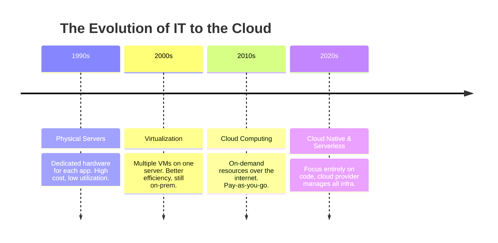

# 1.01 Introduction to Cloud Computing ☁️

## 🎯 Learning Objectives
- Understand what Cloud Computing is and why it exists.
- Differentiate between Traditional IT Infrastructure and Cloud.
- Grasp the 5 essential characteristics of Cloud Computing.
- Explore real-world examples and the pros/cons of Cloud.

---

## 📚 What is Cloud Computing?
**Cloud Computing** is the delivery of computing services—including servers, storage, databases, networking, software, analytics, and intelligence—over the Internet ("the cloud") to offer faster innovation, flexible resources, and economies of scale. You typically pay only for cloud services you use, helping lower your operating costs, run your infrastructure more efficiently, and scale as your business needs change.

### Why it was Introduced?
Historically, companies had to purchase physical servers, rent space in a data center, manage power and cooling, and hire IT staff to maintain hardware. This **On-Premise** (Traditional IT) model had several problems:
- **High Capital Expenditure (CapEx):** You had to buy hardware upfront.
- **Long Procurement Times:** Ordering, shipping, and installing servers took weeks or months.
- **Inflexible Scaling:** You had to guess your capacity needs. If you guessed wrong, you either had idle servers wasting money, or not enough servers and your website crashed.
- **Maintenance Overhead:** Hardware fails, needs patching, and eventually becomes obsolete.

---

## 🏗️ Evolution of IT Infrastructure

---

## ⚖️ Traditional IT vs. Cloud Computing

| Feature | Traditional On-Premise IT | Cloud Computing |
| :--- | :--- | :--- |
| **Cost Model** | Capital Expenditure (CapEx) | Operational Expenditure (OpEx) |
| **Setup Time** | Weeks or Months | Minutes |
| **Scalability** | Manual, requires buying new hardware | Automatic, elastic, instant |
| **Maintenance** | Your responsibility (Hardware & Software) | Hardware managed by provider |
| **Utilization** | Often low (idle resources) | High (shared resources) |

---

## 🌟 The 5 Essential Characteristics of Cloud

According to NIST (National Institute of Standards and Technology), true cloud computing has 5 characteristics:

1. **On-Demand Self-Service:** You can provision compute capabilities automatically without human interaction with the service provider.
2. **Broad Network Access:** Capabilities are available over the network and accessed through standard mechanisms (web browser, mobile phone).
3. **Resource Pooling:** The provider's computing resources are pooled to serve multiple consumers using a multi-tenant model. You might not know the exact physical location of your resources.
4. **Rapid Elasticity:** Capabilities can be elastically provisioned and released, sometimes automatically, to scale rapidly outward and inward commensurate with demand.
5. **Measured Service:** Cloud systems automatically control and optimize resource use by leveraging a metering capability (pay per use).

---

## 🌍 Real-World Examples

- **Netflix Streaming Globally:** Netflix uses AWS to stream thousands of hours of video globally. When viewers spike on a weekend, AWS automatically scales up servers. When traffic drops, it scales down, saving money.
- **Amazon on Black Friday:** The e-commerce giant handles massive spikes in traffic during sales without crashing because of the rapid elasticity of the cloud.
- **Spotify:** Delivers music to millions using cloud infrastructure to store and stream massive audio databases efficiently.

---

## ⚖️ Advantages and Disadvantages

### ✅ Advantages
- **Cost Savings:** Shift from CapEx to OpEx. No upfront hardware costs.
- **Speed & Agility:** Provision resources in minutes, accelerating development.
- **Global Reach:** Deploy applications in multiple regions around the world instantly.
- **Scalability:** Scale vertically (bigger servers) or horizontally (more servers) easily.
- **Reliability:** Cloud providers offer high availability, backup, and disaster recovery.

### ❌ Disadvantages
- **Internet Dependency:** You must have a reliable internet connection to access resources.
- **Vendor Lock-in:** Migrating away from a specific cloud provider (like AWS) can be difficult and costly if you use proprietary services.
- **Security & Privacy Concerns:** You are trusting a third party with your sensitive data.
- **Compliance:** Certain industries have strict data sovereignty laws making public cloud usage complex.

---

## 💡 Real-World Analogy
Think of traditional IT like **buying a car**. You pay a huge upfront cost, you have to pay for maintenance, insurance, and parking, even when you aren't driving it. 
Cloud Computing is like using **Uber or a Taxi**. You don't own the car, you only pay for the distance you travel, you don't worry about maintenance, and you can get a ride exactly when you need it.

---

## ❓ Doubts Discussed

> **Student Doubt:** If my data is on the cloud, can AWS employees look at it?
> **Answer:** AWS operates under a Shared Responsibility Model. AWS is responsible for security *of* the cloud, but you are responsible for security *in* the cloud. If you encrypt your data properly, not even AWS employees can read it.

> **Student Doubt:** Does "infinite scale" mean infinite bills?
> **Answer:** Yes! If you configure auto-scaling without limits, a DDoS attack or a bug could cause your infrastructure to scale massively, resulting in a huge bill. You should always set billing alerts and maximum scaling limits.

---

## ⚠️ Common Mistakes
- **Treating Cloud like On-Prem:** Lifting and shifting old apps to the cloud without modernizing them often leads to higher costs and no benefits.
- **Forgetting to Turn Things Off:** Leaving instances running over the weekend when not needed is a primary source of wasted money.

---

## 📝 Key Takeaways
- Cloud computing shifts IT from CapEx to OpEx.
- The 5 characteristics (On-demand, network access, pooling, elasticity, measured service) define the cloud.
- It offers speed, agility, and global scale but requires careful cost and security management.

---

## 🎤 Interview Questions

### 🟢 Basic

1. What is Cloud Computing in simple terms?

Renting someone else's computers and software over the internet and paying only for what you use.

2. What are the 5 characteristics of Cloud Computing?

On-demand self-service, broad network access, resource pooling, rapid elasticity, measured service.

3. What is the difference between CapEx and OpEx?

CapEx (Capital Expenditure) is upfront spending on physical assets (like buying servers). OpEx (Operational Expenditure) is ongoing spending on day-to-day operations (like renting cloud servers hourly).

### 🟡 Intermediate

4. How does Resource Pooling work in Cloud Computing?

Cloud providers use a multi-tenant model. They have massive physical servers, and through virtualization, they split these resources among multiple customers dynamically based on demand, masking the underlying physical hardware.

5. Explain the concept of Rapid Elasticity.

The ability of cloud resources to scale up (increase capacity) or scale out (add more instances) quickly during demand spikes, and scale back down when demand drops, ensuring you only pay for what you need.

### 🔴 Scenario-Based

6. A retail company expects a 500% spike in traffic during Black Friday. Why is Cloud Computing better than On-Premise for this scenario?

With on-premise, they would have to buy servers just for that one day, which would sit idle the rest of the year (wasted CapEx). With the cloud, they can use Auto-Scaling to automatically add servers during the Black Friday spike and remove them the next day, paying only for the hours they were used.

