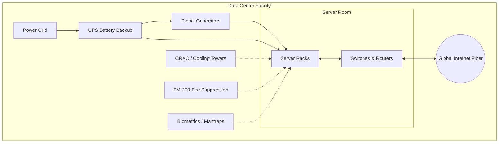

# 1.02 Data Center 🏢

## 🎯 Learning Objectives
- Understand what a Data Center is and its core components.
- Learn why building and maintaining a Data Center is difficult.
- Understand the physical security, cooling, and power infrastructure required.
- Discover why cloud providers build Data Centers across the globe.

---

## 📚 What is a Data Center?
A **Data Center** is a dedicated physical facility that organizations use to house their critical applications and data. It is essentially a massive, highly secure building filled with thousands of computers, networking equipment, and the necessary infrastructure to keep them running 24/7/365 without interruption.

When we talk about "The Cloud," we are actually talking about someone else's Data Centers (like Amazon, Microsoft, or Google's).

---

## 🧩 Components of a Data Center

A Data Center is much more than just a room with computers. It requires specialized engineering:

1. **Server Racks:** Standardized metal frames (usually 19-inch or 23-inch wide) that hold servers, switches, and routers efficiently, maximizing space.
2. **Cooling Systems:** Servers generate massive heat.
   - **CRAC (Computer Room Air Conditioning):** Specialized AC units.
   - **Hot Aisle / Cold Aisle Containment:** Racks are arranged so cold air is pumped into the front (Cold Aisle), and hot air is expelled from the back (Hot Aisle) and exhausted out.
3. **Power Backup:**
   - **UPS (Uninterruptible Power Supply):** Massive battery banks that provide instant power if the grid fails, keeping servers on until generators kick in.
   - **Diesel Generators:** Provide long-term backup power during extended grid outages.
4. **Networking Equipment:**
   - Thousands of miles of fiber optic cables.
   - Switches, routers, and load balancers to route traffic to the outside world.
5. **Physical Security:**
   - Perimeter fences, armed guards.
   - **Mantraps:** Double-door security vestibules where the first door must close before the second opens.
   - Biometric scanners (retina, fingerprint), CCTV.
6. **Fire Suppression:**
   - Water ruins electronics. Data centers use clean agents like **FM-200 or Inergen** gases that chemically suppress fire without harming hardware and leave no residue.

---

## 🏗️ Data Center Architecture

---

## 🤷‍♂️ Why Don't Companies Build Their Own?
- **Massive Capital Cost:** Building a Tier 4 data center costs hundreds of millions of dollars.
- **Expertise:** Requires experts in real estate, power engineering, cooling physics, and security—not just IT.
- **Maintenance:** Ongoing costs for electricity, diesel, security guards, and hardware replacement.
- **Scaling Difficulty:** Once the building is full, you can't just "add more space." You have to build a new one.

---

## 💡 Real-World Analogy
**Building a Data Center vs. Public Cloud** is like **Building an Apartment Complex vs. Renting an Apartment**.
- If you build an apartment complex, you must buy land, hire architects, install plumbing and electrical, manage security, and pay for upkeep of empty units. (This is building your own Data Center).
- If you rent an apartment, you just pay your monthly rent, and the landlord handles the security, water, and building maintenance. You benefit from shared infrastructure. (This is the Public Cloud).

---

## 🛠️ Practical Discussion

### Why can AWS provision servers in minutes?
AWS has massive warehouses of pre-racked, pre-cabled, and pre-powered servers sitting idle. When you click "Launch EC2", software automation simply allocates a slice of that existing hardware to you instantly.

### Why are Data Centers built in multiple geographical locations?
1. **Latency:** To be closer to end-users (A user in India gets faster response from a Mumbai DC than a US DC).
2. **Disaster Recovery:** If a natural disaster destroys one data center, another in a different region can take over.
3. **Compliance:** Laws like GDPR require European citizen data to physically remain inside Europe.

---

## ❓ Doubts Discussed

> **Student Doubt:** How do Data Centers not melt when thousands of servers run at 100%?
> **Answer:** Incredible engineering! They use raised floors to blast freezing air directly into server intakes. Some modern DCs even use liquid cooling, where servers are submerged in non-conductive mineral oil, or build DCs in cold climates (like Iceland) or even underwater to use natural cooling!

---

## ⚠️ Common Mistakes
- **Assuming "The Cloud" is magical:** The cloud is physical. It lives in physical buildings subject to physical laws like power outages, fiber cuts, and latency.

---

## 📝 Key Takeaways
- Data centers are highly engineered fortresses designed for 100% uptime.
- The cost and complexity of building DCs is why cloud computing is so popular.
- Physical infrastructure (power, cooling, fire, security) is just as important as the servers themselves.

---

## 🎤 Interview Questions

### 🟢 Basic

1. What is a Data Center?

A physical facility used to house computer systems, networking, storage, and associated infrastructure like power and cooling.

2. Why don't data centers use water sprinklers for fire suppression?

Water destroys electronic equipment. They use specialized gases (like FM-200) that extinguish fire chemically without damaging hardware.

### 🟡 Intermediate

3. Explain Hot Aisle and Cold Aisle containment.

It's a cooling layout technique. Racks face each other (Cold Aisle) where AC air is pumped into the intakes. The exhausts face each other (Hot Aisle) where hot air is collected and routed back to the AC units, preventing hot and cold air from mixing and improving efficiency.

4. Why do global companies need data centers in different countries?

To reduce latency for local users, to survive regional disasters (high availability), and to comply with data sovereignty laws.

### 🔴 Scenario-Based

5. A power grid fails in the city where a major AWS Data Center is located. Walk through the sequence of events that keeps the servers running.

1. The grid fails. 
2. The massive UPS (Uninterruptible Power Supply) batteries take over instantaneously, ensuring zero milliseconds of downtime. 
3. Within 10-30 seconds, the diesel backup generators automatically start up and synchronize. 
4. The UPS transfers the load to the generators, which can run for days as long as diesel fuel is supplied.

