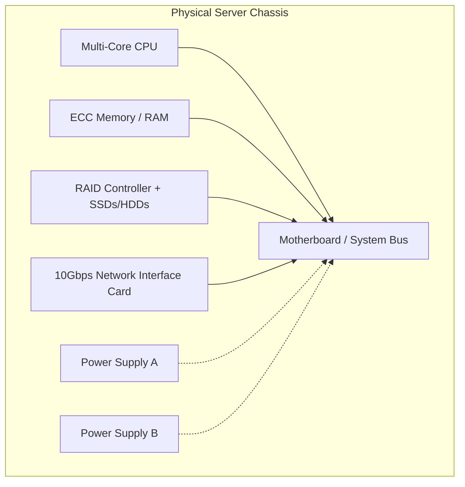

# 1.03 Physical Servers 🖥️

## 🎯 Learning Objectives
- Understand the core physical components of a server.
- Recognize how traditional servers were utilized.
- Understand the problem of resource wastage in dedicated hardware approaches.

---

## 📚 What is a Physical Server?
A physical server is a high-performance computer designed to process requests and deliver data to other computers over a local network or the internet. Unlike your personal laptop, servers are built for extreme durability, 24/7 operation, and massive parallel processing.

### Key Components:
1. **CPU (Central Processing Unit):** The "brain." It has multiple cores and threads (e.g., 64-core processors) to handle thousands of concurrent requests. Determines processing power.
2. **RAM (Random Access Memory):** Volatile, extremely fast memory. The more RAM, the more applications and data the server can hold in active memory. Usually ECC (Error Correcting Code) RAM for reliability.
3. **Storage (HDD vs SSD):** Where data is permanently stored.
   - **HDD (Hard Disk Drive):** Cheaper, higher capacity, but slow (spinning magnetic disks).
   - **SSD (Solid State Drive) / NVMe:** Expensive, lower capacity, but incredibly fast IOPS (Input/Output Operations Per Second).
4. **Motherboard:** The massive circuit board that interconnects the CPU, RAM, Storage, and external cards.
5. **Network Interface Card (NIC):** Connects the server to the network switch. Server NICs often handle 10 Gbps, 25 Gbps, or even 100 Gbps speeds.
6. **Power Supply Units (PSU):** Usually dual-redundant. If one power supply fails, the other instantly takes the full load.

---

## 🏗️ Server Anatomy

---

## 📉 The Problem: Traditional Server Usage & Resource Wastage

Before virtualization and the cloud, the industry standard was the **Dedicated Hardware Approach**: **One Application per Server.**
- You buy a server to run an Email Server.
- You buy another server to run the HR database.
- You buy a third to run the Web Server.

### Why was this bad?
Because physical servers are very powerful, a simple HR application might only use **10-15% of the server's CPU and RAM.**
- The remaining 85% of compute capacity is **wasted**.
- You are still paying 100% of the cost for electricity, cooling, and space.
- You couldn't install the Web Server on the HR Server because if the Web Server crashed, it might take down the HR app (lack of isolation), or they might require different operating systems or conflicting library versions.

---

## 💡 Real-World Analogy
**Dedicated Physical Servers** are like **a single family renting an entire 100-room apartment building.** 
They only sleep in a few rooms, leaving 95 rooms completely empty and unused. However, they are still paying the heating, cooling, and property tax for the entire massive building. It is a massive waste of resources and money.

---

## ❓ Doubts Discussed

> **Student Doubt:** If servers are just computers, can I use my old laptop as a server?
> **Answer:** Technically, yes! Any computer providing a service is a server. However, enterprise servers have redundant parts (dual power supplies, RAID storage, ECC RAM) designed to run for 5 years without ever turning off. Your laptop would quickly overheat or fail under that kind of enterprise load.

---

## ⚠️ Common Mistakes
- **Confusing storage capacity with storage speed:** Having 10 TB of HDD storage is useless for a high-traffic database if the IOPS (speed) is too slow. SSDs are required for performance.

---

## 📝 Key Takeaways
- Servers are industrial-grade computers built for 24/7 reliability.
- Traditional IT resulted in massive resource wastage (10-15% utilization) due to the "one app per server" constraint.

---

## 🎤 Interview Questions

### 🟢 Basic

1. Name the primary hardware components of a physical server.

CPU, RAM, Storage (HDD/SSD), Motherboard, NIC (Network Card), and Power Supply.

2. What was the typical resource utilization percentage of traditional physical servers before virtualization?

Around 10-15%.

### 🟡 Intermediate

3. Why did companies traditionally run only one application per physical server?

To guarantee isolation. If multiple apps ran on the same OS and one app crashed the OS, it would take down all other apps. It also prevented library and dependency conflicts between applications.

### 🔴 Scenario-Based

4. You are tasked with ordering a server for a new high-frequency trading database. Which physical component should you prioritize: HDD capacity or SSD IOPS?

SSD IOPS. High-frequency trading requires extremely fast read/write speeds. HDDs are too slow and would cause unacceptable latency, regardless of their total capacity.

