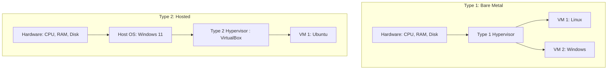

# 1.04 Hypervisor 🧠

## 🎯 Learning Objectives
- Define what a Hypervisor is and its role in computing.
- Differentiate between Type 1 and Type 2 Hypervisors.
- Understand how hypervisors allocate resources and isolate VMs.
- Learn the lifecycle of a Virtual Machine.

---

## 📚 What is a Hypervisor?
A **Hypervisor** (or Virtual Machine Monitor - VMM) is a crucial layer of software that enables virtualization. It allows a single physical computer (the Host) to run multiple isolated operating systems (Virtual Machines or Guests) concurrently.

The Hypervisor acts like a traffic cop, sitting between the physical hardware (CPU, RAM, Storage) and the VMs. It intercepts requests from the VMs and safely allocates physical resources to them without letting the VMs interfere with each other.

---

## 🔀 Types of Hypervisors

### Type 1: Bare Metal Hypervisors
- **How it works:** The hypervisor is installed **directly onto the bare physical hardware**, replacing a traditional operating system (like Windows or Linux).
- **Performance:** Extremely high performance, low latency, and highly secure.
- **Use Case:** Enterprise Data Centers, Cloud Providers (AWS, Azure).
- **Examples:** VMware ESXi, Microsoft Hyper-V, Xen, KVM (Kernel-based Virtual Machine), AWS Nitro.

### Type 2: Hosted Hypervisors
- **How it works:** The hypervisor is installed as an **application on top of an existing host operating system** (like installing a program on Windows 11).
- **Performance:** Slower performance because commands must pass through the hypervisor AND the host OS before reaching hardware.
- **Use Case:** Software development, testing, student labs, desktop virtualization.
- **Examples:** Oracle VirtualBox, VMware Workstation, Parallels Desktop (for Mac).

---

## 🏗️ Architecture Diagrams

---

## ⚙️ How Hypervisors Manage Resources

1. **Resource Allocation:** 
   - **CPU Pinning / vCPU scheduling:** The hypervisor schedules virtual CPU (vCPU) instructions onto the physical CPU cores.
   - **Memory Ballooning:** The hypervisor can dynamically take unused RAM from one VM and give it to another VM that is struggling.
2. **Strict Isolation:** 
   - If VM #1 gets a devastating virus, crashes, or is hacked, VM #2 running on the exact same physical hardware is completely unaffected. The hypervisor creates an impenetrable software wall between them.

---

## 🔄 VM Lifecycle managed by Hypervisor
1. **Create:** Allocate vCPU, vRAM, and create a virtual disk file (like `.vmdk` or `.vdi`).
2. **Start (Boot):** The VM powers on and loads its OS.
3. **Snapshot:** The hypervisor captures the exact state of the VM (disk and memory) at a point in time. Great for backups before doing risky updates.
4. **Migrate (Live Migration):** Moving a running VM from one physical server to another *without dropping a single packet or pausing the app*.
5. **Stop / Delete:** Destroy the VM and instantly return resources to the physical pool.

---

## 💡 Real-World Analogy
Think of the physical server as a **large piece of land**, and the VMs as **individual houses** built on that land. 
The **Hypervisor is the City Planner/Utility Company**. It ensures that the water supply, electricity (CPU/RAM), and roads (Network) are fairly divided among the houses, and ensures that a fire in House A (a crash) doesn't spread to House B (isolation).

---

## ❓ Doubts Discussed

> **Student Doubt:** How does AWS do this? Do they use VMware?
> **Answer:** Early on, AWS used customized versions of Xen. Now, they use their own custom-built hypervisor called **AWS Nitro**. Nitro actually moves the hypervisor functions onto dedicated hardware cards inside the server, leaving almost 100% of the main server CPU and RAM available for customer VMs!

---

## ⚠️ Common Mistakes
- **Using Type 2 in Production:** Never run production company workloads on VirtualBox running on top of Windows. It's too slow and prone to crashes if the underlying Windows host updates or reboots. Always use Type 1.

---

## 📝 Key Takeaways
- Hypervisors are the magic software that makes the Cloud possible.
- Type 1 is for Enterprise (Bare metal = fast).
- Type 2 is for Personal/Dev use (Hosted = convenient).
- Hypervisors provide isolation and resource allocation.

---

## 🎤 Interview Questions

### 🟢 Basic

1. What is a Hypervisor?

Software that creates and runs virtual machines, managing the translation between virtual resources and physical hardware.

2. Name two examples of a Type 1 Hypervisor.

VMware ESXi, Microsoft Hyper-V (or KVM, Xen).

### 🟡 Intermediate

3. What is the fundamental difference between a Type 1 and Type 2 hypervisor?

Type 1 runs directly on the bare metal hardware. Type 2 runs as an application on top of a standard host operating system. Type 1 is faster and more secure.

4. Explain VM Isolation.

The hypervisor ensures that each VM is completely separated from others. A crash, malware infection, or resource spike in one VM cannot affect the neighboring VMs on the same physical host.

### 🔴 Scenario-Based

5. Your development team wants to test a new Linux software on their Windows laptops. Should they use a Type 1 or Type 2 hypervisor?

Type 2 (like VirtualBox or VMware Workstation). It allows them to keep their Windows host OS running for daily tasks while running Linux in an application window for testing. Installing a Type 1 would wipe their laptops.

