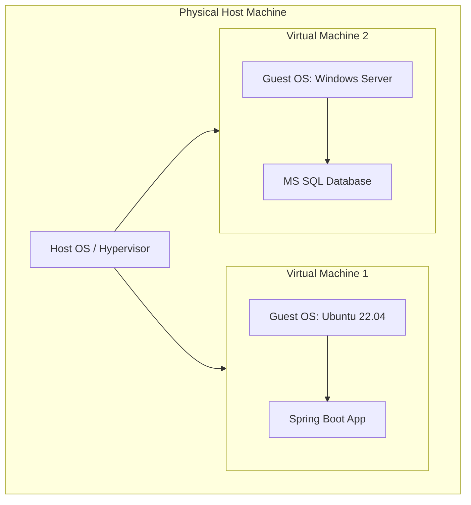

# 1.05 Virtual Machine (VM) 🖥️☁️

## 🎯 Learning Objectives
- Define what a Virtual Machine is.
- Understand the difference between Host OS and Guest OS.
- Learn how virtual resources map to physical resources.
- Compare Physical Machines to Virtual Machines.

---

## 📚 What is a Virtual Machine?
A **Virtual Machine (VM)** is a software emulation of a physical computer. To the user and the software running inside it, a VM looks and behaves exactly like a real, physical server. It has its own CPU, memory, network interface, and storage—but these are all generated by software (the hypervisor) using resources borrowed from the physical host machine.

When you spin up an "EC2 Instance" in AWS, you are creating a Virtual Machine.

### Host OS vs. Guest OS
- **Host OS:** The operating system running directly on the physical hardware (only applies to Type 2 hypervisors, as Type 1 replaces the Host OS).
- **Guest OS:** The operating system installed *inside* the Virtual Machine.
  *(e.g., You have a Mac laptop (Host OS: macOS), and you run a VM with Windows 11 (Guest OS: Windows).*

---

## ⚙️ Virtual Resource Allocation
A physical server has physical hardware. The VM has *virtual* hardware mapped to the physical:
- **vCPU (Virtual CPU):** Mapped to threads/cores of the physical CPU.
- **vRAM (Virtual RAM):** A reserved chunk of the physical RAM.
- **vDisk (Virtual Disk):** The physical server's hard drive sees the VM's entire hard drive as just one large file (e.g., `my-server.vmdk`).
- **vNIC (Virtual Network Card):** The hypervisor acts as a virtual network switch, routing traffic from the VM to the physical network card.

---

## 🌟 Advantages of Virtual Machines

1. **Isolation:** Each VM has its own kernel, file system, and processes. A bug in one VM cannot crash another.
2. **Portability:** Because a VM's entire hard drive is just a single file on the host machine, you can copy that file to a USB drive, move it to a completely different physical server, and boot it up instantly.
3. **Snapshots:** You can save the exact state of a VM at a specific second. If an update breaks the server, you can click "revert" and instantly go back in time.
4. **Easy Cloning:** Need 5 identical web servers? Create one VM, configure it, and copy/paste it 4 times.

---

## ⚖️ Virtual Machine vs Physical Machine

| Feature | Physical Machine (Bare Metal) | Virtual Machine |
| :--- | :--- | :--- |
| **Hardware** | Tangible, physical components | Emulated by software |
| **Deployment Time** | Days / Weeks (Ordering, racking) | Seconds / Minutes |
| **Portability** | Hard to move (must physically move server) | Easy to move (just copy a file) |
| **Cloning** | Reinstall OS, reconfigure manually | Right-click -> Clone |
| **Resource Usage** | Single OS, often wastes 80% capacity | Shared, highly efficient utilization |

---

## 💡 Real-World Analogy
A physical machine is like buying a **VCR player**. It does one thing, it's a physical box, and to duplicate a movie, you need another tape and a long time to copy it.
A Virtual Machine is like an **MP4 video file**. It looks and plays just like the movie, but it's just software. You can easily copy it, email it, pause it, and play multiple movies on the same screen simultaneously.

---

## ❓ Doubts Discussed

> **Student Doubt:** Does the Guest OS know it is a Virtual Machine?
> **Answer:** Usually, no. The Hypervisor does such a good job emulating standard hardware (like a standard Intel CPU and generic hard drive) that the Guest OS thinks it's running on real metal. However, modern OSs have "VM Tools" that can be installed to let the OS talk better with the hypervisor for improved performance.

---

## ⚠️ Common Mistakes
- **Overprovisioning:** Giving a VM 16 vCPUs and 64GB of RAM just because you can, without checking if the app actually needs it. This starves other VMs on the same host of resources.

---

## 📝 Key Takeaways
- A VM is a computer file that behaves like a full physical computer.
- The separation of Guest OS from underlying hardware allows for incredible portability, cloning, and snapshots.
- VMs are the fundamental building blocks of early Cloud Computing (IaaS).

---

## 🏗️ Architecture & Flowchart

---

## 🎤 Interview Questions

### 🟢 Basic

1. What is a Virtual Machine?

A software-based emulation of a physical computer that runs an operating system and applications just like a real machine.

2. What is the difference between a Host OS and a Guest OS?

Host OS is the operating system running directly on the physical hardware. Guest OS is the operating system running inside the isolated Virtual Machine.

### 🟡 Intermediate

3. Explain how VM Portability works.

Because the entire VM (its OS, applications, and data) is encapsulated into a set of software files (usually a configuration file and a virtual disk file), these files can be easily copied and moved to different physical servers with compatible hypervisors.

### 🔴 Scenario-Based

4. You are about to run a major, risky database upgrade on a VM. What hypervisor feature should you use before starting, and why?

You should take a VM Snapshot. If the database upgrade corrupts the system, you can instantly revert the VM back to the exact state it was in at the moment the snapshot was taken, saving hours of restoration time.

