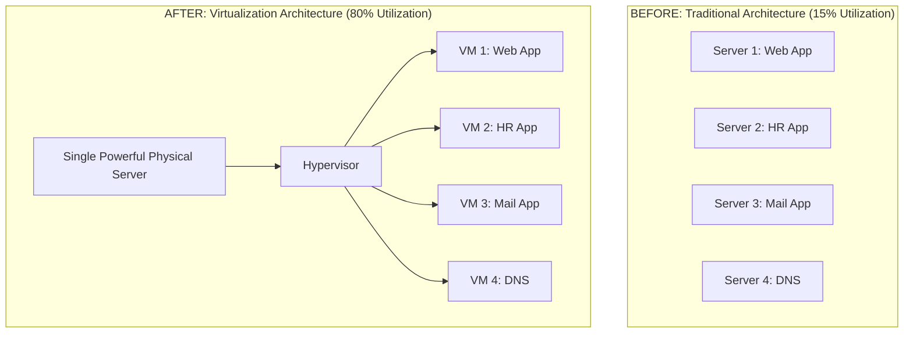

# 1.06 Virtualization 🧩

## 🎯 Learning Objectives
- Understand why virtualization was invented to solve the resource wastage problem.
- Learn about the concept of Consolidation Ratio.
- See the before-and-after impact of virtualization on IT efficiency and cost.

---

## 📚 Why Virtualization? (The Problem it Solves)

As discussed in Section 1.03, the traditional "One App per Physical Server" model led to massive resource wastage. A typical data center had hundreds of servers running at **10% to 15% utilization**. 

Virtualization was adopted globally to solve this specific problem. **Virtualization** is the process of creating a software-based (or virtual) representation of something, such as virtual applications, servers, storage, and networks. 

By inserting a hypervisor, IT departments realized they could put 10, 20, or even 50 Virtual Machines onto a single powerful physical server.

---

## 📈 Consolidation Ratio
The **Consolidation Ratio** is a key metric in virtualization. It refers to the number of Virtual Machines running on a single physical host. 
- A consolidation ratio of `15:1` means 15 VMs are running on one physical server.
- The higher the ratio, the better the hardware utilization and the greater the cost savings.

---

## 🏗️ Before and After Virtualization

---

## 💰 The Benefits of Virtualization

1. **Massive Cost Reduction (CapEx):** Instead of buying 100 physical servers, a company only needs to buy 10 highly powerful servers.
2. **Less Power and Cooling (OpEx):** 10 servers require significantly less electricity and air conditioning than 100 servers.
3. **Space Savings:** Shrinks the data center footprint. You need fewer server racks, saving on real estate costs.
4. **Faster Provisioning:** Setting up a new server went from a 3-week procurement process to a 5-minute software deployment.
5. **Better Resource Utilization:** Average CPU utilization jumped from 10-15% to **60-80%**.

---

## 💡 Real-World Analogy
**Virtualization is like Carpooling.** 
In the traditional model, 4 people living in the same neighborhood all drive their own cars to the same office. It wastes gas, causes traffic, and takes up 4 parking spaces (10% utilization per car).
With virtualization (carpooling), all 4 people ride in 1 car. They get to the same destination securely, but they use 1 parking space and split the gas cost (80% utilization of the car).

---

## ❓ Doubts Discussed

> **Student Doubt:** If one physical server hosts 20 VMs, what happens if that physical server catches on fire? Don't we lose 20 servers at once?
> **Answer:** Excellent question! Yes, this creates a Single Point of Failure. To solve this, virtualization software uses clusters and shared storage. If Server A catches fire, the Hypervisor cluster detects it and automatically restarts those 20 VMs onto Server B and Server C within seconds. This is called High Availability (HA).

---

## ⚠️ Common Mistakes
- **Resource Contention (Noisy Neighbor):** Trying to squeeze a 100:1 consolidation ratio on weak hardware. If all 100 VMs try to use the CPU at the exact same time, the system grinds to a halt. Proper capacity planning is required.

---

## 📝 Key Takeaways
- Virtualization revolutionized IT by breaking the 1:1 bond between hardware and operating systems.
- It drives massive cost savings in power, cooling, space, and hardware purchases.
- It is the foundational technology that made Public Cloud computing (like AWS) economically viable.

---

## 🎤 Interview Questions

### 🟢 Basic

1. What is the primary problem that virtualization solves?

Low resource utilization and resource wastage caused by the traditional "one application per physical server" deployment model.

2. What does Consolidation Ratio mean in virtualization?

It is the number of virtual machines running on a single physical host server (e.g., 20:1).

### 🟡 Intermediate

3. How does virtualization lead to OpEx savings?

By reducing the number of physical servers needed, organizations spend significantly less on electricity for powering servers, less on cooling/AC, and less on data center floor space rental.

### 🔴 Scenario-Based

4. A client has 50 physical servers running at 10% CPU utilization. They want to migrate to a virtualized environment. If the target utilization per new physical host is 80%, roughly how many physical hosts will they need?

Total current utilization: 50 servers * 10% = 500% total CPU units needed. Target per host: 80%. 
Total hosts needed = 500 / 80 = 6.25. 
They would need about 7 physical servers, effectively replacing 50 older machines, resulting in a ~7:1 consolidation ratio. (Note: Additional capacity would be needed for High Availability / Failover).

