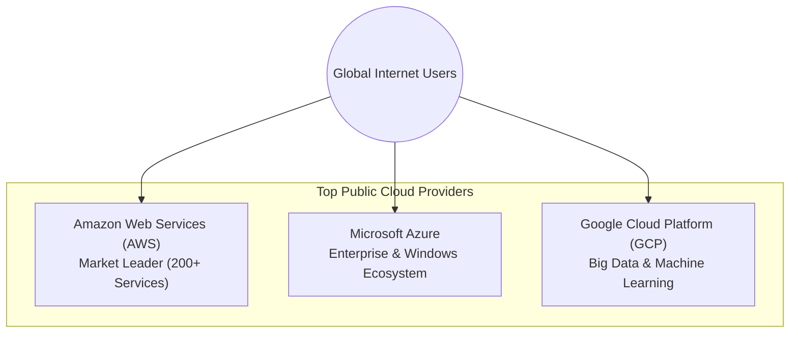

# 1.07 Public Cloud 🌍

## 🎯 Learning Objectives
- Define what a Public Cloud is.
- Understand the concept of shared infrastructure (multi-tenancy).
- Compare the major Public Cloud providers (AWS, Azure, GCP).
- Weigh the advantages and disadvantages of Public Cloud.

---

## 📚 What is a Public Cloud?
A **Public Cloud** is a type of computing where cloud services (servers, storage, databases) are offered by a third-party provider over the public internet, making them available to anyone who wants to purchase them.

In a Public Cloud, all the physical hardware, software, and underlying infrastructure is owned and managed by the cloud provider. 

### The Shared Infrastructure Model (Multi-Tenancy)
Public clouds operate on a multi-tenant architecture. This means your virtual servers might be running on the exact same physical server as another company's virtual servers. The hypervisor (discussed in 1.04) ensures complete isolation and security between tenants, even though the physical hardware is shared.

---

## 🏆 Major Public Cloud Providers

| Provider | Parent Company | Market Position | Key Strengths |
| :--- | :--- | :--- | :--- |
| **AWS** | Amazon | #1 (Market Leader) | Oldest, most services (200+), largest global footprint, highly mature ecosystem. |
| **Azure** | Microsoft | #2 | Seamless integration with Microsoft enterprise products (Windows, Active Directory, Office 365). |
| **GCP** | Google | #3 | Data analytics, artificial intelligence, machine learning, and Kubernetes/containerization. |

---

## ⚖️ Advantages and Disadvantages

### ✅ Advantages
- **Zero Upfront Cost:** No CapEx. You do not need to buy hardware.
- **Maintenance Free:** The provider handles physical security, power, hardware failure, and hypervisor patching.
- **Infinite Scalability:** Access to near-limitless resources instantly to handle global traffic spikes.
- **Innovation Speed:** Access to cutting-edge technologies (AI, Quantum computing) without building them yourself.
- **High Reliability:** Providers offer global networks of data centers for robust disaster recovery.

### ❌ Disadvantages
- **Less Control:** You cannot walk into the data center and touch your server. You cannot customize the underlying physical hardware.
- **Security & Trust:** You must trust the provider to secure the physical layer and properly isolate tenants.
- **Vendor Lock-in:** If you build your app using proprietary AWS services (like DynamoDB), migrating to Azure later will require rewriting your code.
- **Compliance Challenges:** Some governments forbid citizen data from being stored on public cloud servers outside the country's borders.

---

## 💡 Real-World Analogy
The **Public Cloud** is like a **Public Bus System** or an **Apartment Building**.
- **Public Bus:** You share the bus with other passengers (multi-tenancy). You don't buy or maintain the bus (no CapEx, no maintenance). You just pay a small fee for your ride (pay-as-you-go). It's incredibly cost-effective, but you can't choose the exact route or paint the bus your favorite color (less control).

---

## ❓ Doubts Discussed

> **Student Doubt:** If I share a physical server with Netflix on AWS, can Netflix's high traffic slow down my server?
> **Answer:** No. Cloud providers use strict resource allocation. If you pay for 4 vCPUs and 16GB of RAM, the hypervisor guarantees those resources to you. If the physical server runs out of capacity, the provider simply migrates workloads to another server.

---

## ⚠️ Common Mistakes
- **Assuming Public Cloud is "Insecure":** Many companies think On-Premise is more secure. In reality, AWS has thousands of the world's best security engineers. Your On-Premise data center is likely far less secure than AWS, provided you configure your AWS environment correctly.

---

## 📝 Key Takeaways
- Public cloud is shared infrastructure accessed over the internet.
- AWS, Azure, and GCP are the dominant players, each with specific strengths.
- It offers unmatched speed and scale but requires careful architecture to avoid vendor lock-in and manage costs.

---

## 🏗️ Architecture & Flowchart

---

## 🎤 Interview Questions

### 🟢 Basic

1. Define Public Cloud.

Computing services offered by third-party providers over the public internet, available to anyone, where infrastructure is shared among multiple customers.

2. Name the top three public cloud providers.

Amazon Web Services (AWS), Microsoft Azure, and Google Cloud Platform (GCP).

### 🟡 Intermediate

3. Explain the concept of Multi-Tenancy in Public Cloud.

Multi-tenancy means multiple different customers (tenants) share the same underlying physical hardware resources, but their data and applications are strictly isolated from each other via virtualization.

### 🔴 Scenario-Based

4. A startup wants to build a machine learning application and they use Google Workspace for all their employees. Which cloud provider might they naturally lean towards and why?

They might lean towards GCP (Google Cloud Platform) because GCP is renowned for its strong Data/AI/ML capabilities, and it integrates well with the Google ecosystem they are already using. However, AWS would also be a highly capable choice.

