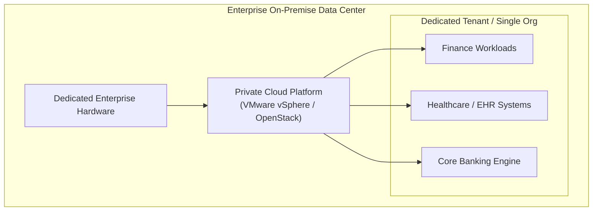

# 1.08 Private Cloud 🔐

## 🎯 Learning Objectives
- Define what a Private Cloud is.
- Understand the technologies used to build a Private Cloud.
- Identify which industries require Private Clouds and why.
- Weigh the advantages and disadvantages compared to Public Cloud.

---

## 📚 What is a Private Cloud?
A **Private Cloud** consists of cloud computing resources used exclusively by one single business or organization. 

Unlike the public cloud, there is **no multi-tenancy** with other companies. The physical infrastructure can be located in the company's on-site data center, or hosted by a third-party service provider, but the hardware and network are dedicated solely to that one organization.

It provides the cloud "experience" (self-service portals, automation, virtualization) but on private hardware.

---

## 🛠️ Technologies Used to Build Private Clouds
To build a Private Cloud, an organization buys physical servers and installs specialized cloud-management software on top of their hypervisors.
- **VMware vSphere / vCloud:** The dominant commercial enterprise software for building private clouds.
- **OpenStack:** A popular open-source platform that allows companies to build AWS-like infrastructure in their own data centers.
- **Nutanix:** A leading Hyper-Converged Infrastructure (HCI) platform.

---

## 🏦 Enterprise Usage: Who uses Private Cloud?

Private clouds are generally used by large enterprises or organizations that handle highly sensitive data and face strict regulatory requirements:
- **Banking & Financial Institutions:** Must protect highly sensitive financial data and comply with PCI-DSS.
- **Healthcare Providers:** Must protect patient medical records and comply with HIPAA.
- **Government & Military:** Cannot risk national security data residing on public, shared infrastructure.

---

## ⚖️ Advantages and Disadvantages

### ✅ Advantages
- **Maximum Security & Privacy:** Complete isolation on a physical level. No sharing hardware with other companies.
- **Total Control:** The organization has granular control over the physical hardware, networking, and security appliances.
- **Regulatory Compliance:** Easier to meet strict data sovereignty laws (e.g., data must physically stay within a specific city or building).
- **Predictable Performance:** Since hardware is dedicated, there is zero risk of interference from other tenants.

### ❌ Disadvantages
- **High CapEx & OpEx:** Requires massive upfront investment to buy the hardware, plus ongoing costs for power, cooling, and real estate.
- **Maintenance Burden:** The organization must hire a full IT staff to patch hypervisors, replace failed hard drives, and manage physical security.
- **Limited Scalability:** You can only scale up to the physical limit of the hardware you own. If you run out of servers, you cannot instantly click a button to get more; you must order, wait, and install new hardware.

---

## 💡 Real-World Analogy
If Public Cloud is renting an apartment or riding a public bus, **Private Cloud is Owning a Private Mansion or a Private Jet**.
- You have complete control over who enters.
- You can customize every single detail of the interior.
- However, you are entirely responsible for the massive purchase cost, the ongoing maintenance, paying the security staff, and if you need a bigger house, you have to build an extension yourself.

---

## ❓ Doubts Discussed

> **Student Doubt:** If Private Cloud is so expensive and hard to manage, why doesn't everyone just use AWS?
> **Answer:** It mostly comes down to Law and Customization. Governments often pass laws preventing certain data from leaving the premises. Also, some legacy mainframes or customized manufacturing systems simply cannot run on standard public cloud hardware and require bespoke physical setups.

---

## ⚠️ Common Mistakes
- **Thinking On-Premise and Private Cloud are exactly the same:** "On-Premise" just means the servers are in your building. A "Private Cloud" means you have added a software layer (like OpenStack) that gives your developers a self-service portal to spin up VMs automatically, just like AWS, but on your own hardware.

---

## 📝 Key Takeaways
- Private cloud is single-tenant, dedicated infrastructure.
- It is driven by security, compliance, and control needs.
- It lacks the infinite elasticity and cost-efficiency of the public cloud.

---

## 🏗️ Architecture & Flowchart

---

## 🎤 Interview Questions

### 🟢 Basic

1. Define Private Cloud.

Cloud infrastructure operated solely for a single organization, managed internally or by a third-party, and hosted internally or externally, with no shared resources (single-tenant).

2. Name two software platforms used to build Private Clouds.

VMware vSphere and OpenStack.

### 🟡 Intermediate

3. Why would a hospital choose a Private Cloud over a Public Cloud?

To ensure strict compliance with healthcare regulations (like HIPAA), maintain absolute physical control over sensitive patient records, and guarantee complete isolation from other organizations.

### 🔴 Scenario-Based

4. Your company runs a Private Cloud. Over the weekend, a marketing campaign goes viral and traffic increases by 1000%. What happens, and how does this differ from Public Cloud?

In a Private Cloud, your servers will likely crash or become extremely slow once the physical capacity limits of your hardware are reached. You cannot instantly scale beyond what you physically own. In a Public Cloud, Auto-Scaling would dynamically add more resources from the provider's massive pool to handle the 1000% spike.

