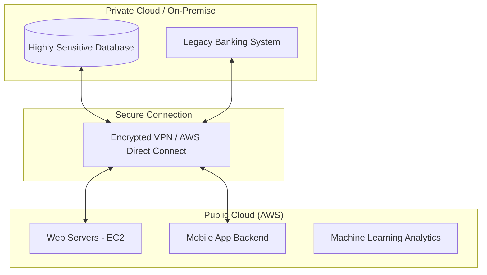

# 1.09 Hybrid Cloud 🔗

## 🎯 Learning Objectives
- Define what a Hybrid Cloud is.
- Understand how and why public and private clouds are connected.
- Analyze real-world use cases (Banking, Healthcare).
- Review a Hybrid Cloud architecture diagram.

---

## 📚 What is a Hybrid Cloud?
A **Hybrid Cloud** is a computing environment that combines a **Public Cloud** and a **Private Cloud** (or on-premises infrastructure) by allowing data and applications to be shared between them. 

It provides businesses with greater flexibility, more deployment options, and helps optimize existing infrastructure, security, and compliance. To work properly, the two environments must be connected via a secure, dedicated, high-speed network link (like AWS Direct Connect).

---

## 🏗️ Hybrid Cloud Architecture

---

## 🌟 Why Use a Hybrid Cloud? (The "Best of Both Worlds")

Organizations rarely move to the cloud overnight. Hybrid Cloud is often a deliberate strategy (or a transitional phase) to balance security and innovation.

1. **Regulatory Compliance vs. Innovation:** Keep regulated data in the private cloud, but run modern web apps and AI analytics in the public cloud.
2. **Cloud Bursting:** An application runs in the private cloud normally. When there is a massive spike in demand (e.g., holiday shopping), the application "bursts" into the public cloud to borrow extra compute power, then shrinks back down when the spike is over.
3. **Disaster Recovery:** Run primary production on-premise, but replicate data to the public cloud. If the local data center burns down, failover to the public cloud.

---

## 🏥 Real-World Examples

### 🏦 Banking Example
A major bank has an interactive mobile app for its customers.
- **Public Cloud:** The bank hosts the mobile app's web servers, UI, and load balancers on AWS because they need global reach and fast scalability during peak login times (e.g., payday).
- **Private Cloud:** The actual customer account balances, transaction history, and legacy mainframes remain in the bank's highly secure, on-premise Private Cloud due to strict financial regulations.
- **The Hybrid Link:** When a user logs into the app (Public Cloud), the app securely queries the on-premise database (Private Cloud) to fetch the balance.

### 🩺 Healthcare Example
A large hospital network uses ML for research.
- **Private Cloud:** Patient Medical Records (EMR) are stored on-premise to comply with HIPAA.
- **Public Cloud:** Anonymized data is pushed to GCP (Google Cloud) to utilize powerful Machine Learning models to research disease patterns, as the hospital cannot afford the supercomputers required for ML on-premise.

---

## 💡 Real-World Analogy
**Hybrid Cloud** is like **Owning a House but Renting a Storage Unit or Hotel Room.**
- Your House (Private Cloud) holds your most valuable, personal, and sensitive items. You have the key, and you control the security.
- The Storage Unit/Hotel (Public Cloud) is used when you run out of space at home, or when you travel and need temporary accommodation. You seamlessly move between both depending on your needs.

---

## ❓ Doubts Discussed

> **Student Doubt:** Isn't the connection between the Private and Public cloud a major security risk?
> **Answer:** It can be if done poorly over the public internet. Enterprises use services like **AWS Direct Connect**, which is a physical, private fiber-optic cable connecting their data center directly to AWS, bypassing the public internet entirely for maximum security and speed.

---

## ⚠️ Common Mistakes
- **Assuming Hybrid is Easy:** Managing a Hybrid Cloud is significantly harder than managing just Public or just Private. Your IT team now needs expertise in *both* environments and must manage complex networking and security rules between them.

---

## 📝 Key Takeaways
- Hybrid Cloud blends Public and Private cloud infrastructure.
- It is the most common deployment model for large enterprises today.
- It allows companies to satisfy compliance needs while still leveraging public cloud innovation and elasticity.

---

## 🎤 Interview Questions

### 🟢 Basic

1. What is a Hybrid Cloud?

A computing environment that combines a public cloud and a private cloud, allowing data and applications to be shared between them.

2. What is "Cloud Bursting"?

A configuration where an application runs in a private cloud or local data center and bursts into a public cloud when the demand for computing capacity spikes.

### 🟡 Intermediate

3. Why is Hybrid Cloud considered the most complex deployment model?

Because it requires managing two completely different environments, maintaining secure and high-speed networking between them, and ensuring seamless data synchronization and consistent security policies across both.

### 🔴 Scenario-Based

4. A government agency wants to launch a public-facing portal for citizens to view public records, but the underlying database contains highly classified citizen profiles that by law cannot be hosted externally. What cloud model should they use and how should it be architected?

They should use a Hybrid Cloud model. The public-facing portal (web servers) should be hosted on a Public Cloud to handle high traffic and provide DDoS protection. The classified database remains on a Private Cloud. The web servers query the private database over a secure, dedicated connection (like AWS Direct Connect/VPN) retrieving only the permitted public records.

