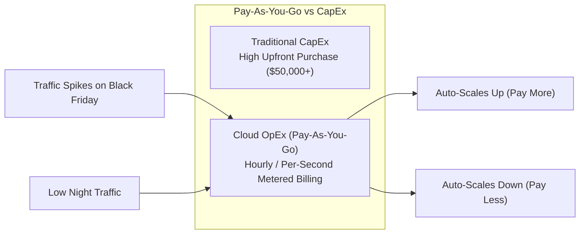

# 1.10 Pay-As-You-Go 💸

## 🎯 Learning Objectives
- Understand the Pay-As-You-Go billing model in Cloud Computing.
- Grasp how economies of scale make the cloud cheaper.
- Understand the relationship between Elasticity and Billing.

---

## 📚 What is the Pay-As-You-Go Model?
In traditional IT, you buy a server (CapEx). Whether you use that server 100% of the time or 0% of the time, the cost remains the same. 

The **Pay-As-You-Go** (or utility) model means you are billed purely based on your actual consumption of resources, usually tracked by the second, minute, or hour. 
- No upfront commitment.
- No long-term contracts (unless you choose them for a discount).
- If you terminate the resource, the billing stops immediately.

---

## ⚡ How it applies to Cloud Services (Examples)

- **Compute (AWS EC2):** You are billed per second while the virtual machine is in the "Running" state. If you "Stop" the VM, you are no longer billed for the compute power (though you still pay a tiny amount for the stored data).
- **Storage (AWS S3):** You are billed per Gigabyte (GB) of data stored per month. If you delete files, your bill drops the next month.
- **Serverless (AWS Lambda):** You are billed based on the number of requests and the execution duration in *milliseconds*. If your code is not triggered, you pay exactly $0.00.

---

## 📉 Why is the Cloud Cheaper? (Economies of Scale)
How can Amazon buy servers, manage data centers, make a profit, and *still* be cheaper than you doing it yourself?

**Economies of Scale:** Because AWS buys hardware in massive, unprecedented bulk (millions of servers), they negotiate extreme discounts from hardware manufacturers like Intel and Seagate. They pass these savings on to customers in the form of lower Pay-As-You-Go prices. A small company buying 10 servers cannot get the same hardware price as Amazon buying 100,000 servers.

---

## 📈 Elasticity + Pay-As-You-Go = Maximum Efficiency
The true power of this model is unlocked by **Rapid Elasticity** (Auto-Scaling).

Imagine a food delivery app:
- **Nighttime (Low Traffic):** 2 servers running. You pay for 2 servers.
- **Lunchtime (High Traffic):** System scales to 10 servers automatically. You pay for 10 servers for exactly 2 hours.
- **Afternoon (Medium Traffic):** System scales down to 4 servers. You pay for 4.

You perfectly match your expenses to your customer demand, eliminating wasted spending.

---

## 💡 Real-World Analogies

### 1. The Electricity Bill 💡
When you turn on the lights in your house, the meter spins, and you are charged. When you leave the room and turn off the light, the meter stops, and you stop paying. You don't pay a fixed $500/month for the *potential* to use electricity; you pay for the exact kilowatts consumed.

### 2. The Taxi Meter 🚕
When you get into a taxi, the meter starts running. You pay for the exact distance and time traveled. When you step out, you stop paying. You don't have to buy the taxi, pay for its gas, or pay the driver's health insurance.

---

## ❓ Doubts Discussed

> **Student Doubt:** If I create a server and don't use it, do I still pay?
> **Answer:** YES! This is a massive misconception. If an EC2 instance is in the "Running" state, you are billed for it, even if 0 users are visiting your website. The cloud provider has dedicated that hardware to you. To stop paying, you must "Stop" or "Terminate" the resource.

---

## ⚠️ Common Mistakes
- **The "Zombie" Server:** Developers spin up resources for testing on a Friday, forget to delete them, and come back on Monday to a massive unexpected bill. Always set up billing alerts!

---

## 📝 Key Takeaways
- Pay-As-You-Go shifts costs from CapEx to OpEx.
- You are billed for allocation/runtime, not necessarily utilization. (If it's running, you pay).
- Elasticity combined with utility billing prevents you from paying for idle capacity.

---

## 🏗️ Architecture & Flowchart

---

## 🎤 Interview Questions

### 🟢 Basic

1. What does the Pay-As-You-Go model mean in cloud computing?

It is a billing method where you only pay for the computing resources you actually consume, without any upfront costs or long-term commitments.

2. How are serverless technologies like AWS Lambda billed?

They are billed based on the exact number of invocations (requests) and the duration of execution down to the millisecond.

### 🟡 Intermediate

3. Explain "Economies of Scale" in the context of cloud computing.

Because cloud providers operate on a massive global scale, they purchase hardware, power, and bandwidth in enormous bulk at deep discounts. They pass these savings to consumers, making cloud computing cheaper than maintaining a private data center for many businesses.

### 🔴 Scenario-Based

4. A developer spins up a large database instance on AWS. For a week, absolutely no data is written to or read from the database. Will the company be billed for this week?

Yes. In cloud computing, you are billed for provisioned running resources, regardless of whether you are actively utilizing them. Because the database instance was running and consuming underlying hardware capacity, the cloud provider will bill for the hours it was active.

