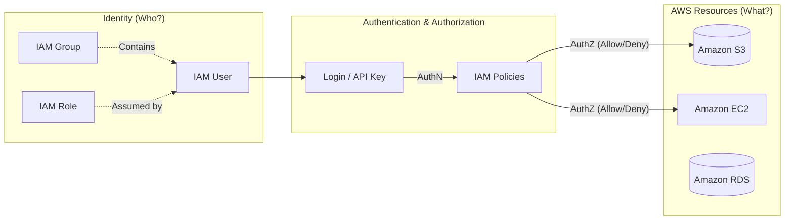

# 2.1 Introduction to IAM 🛡️

Welcome to the first section of Chapter 2! Identity and Access Management (IAM) is the foundational security service in AWS. 

---

## 🎯 Learning Objectives
By the end of this section, you will be able to:
- Define what AWS IAM is and why it exists.
- Understand the core concepts: Identity, Resource, and Access Management.
- Explain the Principle of Least Privilege.
- Recognize IAM as a Global Service.

---

## 📚 Detailed Topic Coverage

### What is IAM?
**IAM (Identity and Access Management)** is a web service that helps you securely control access to AWS resources. You use IAM to control who is authenticated (signed in) and authorized (has permissions) to use resources.

📌 **Key Characteristics of IAM:**
1. **Free Service:** AWS does not charge you for using IAM. You only pay for the resources (like EC2, S3) that your IAM users consume.
2. **Global Service:** IAM is **NOT** region-specific. When you create a user, group, or role in IAM, it is available across all AWS Regions globally. (You will notice "Global" in the top right of your AWS console when you are in the IAM dashboard).

### Why Does IAM Exist?
Without IAM, anyone logging into your AWS account would have full access to everything. This is dangerous! IAM exists for:
- **Security:** Preventing unauthorized access to infrastructure.
- **Access Control:** Ensuring developers can only access development servers, and production stays isolated.
- **Compliance:** Auditing who did what and when (integrated with AWS CloudTrail).

### The Principle of Least Privilege ⚖️
This is the golden rule of AWS Security.
> **Principle of Least Privilege:** Granting a user *only* the minimum permissions they need to perform their specific job—nothing more.

If a developer only needs to read files from an S3 bucket, you give them `s3:GetObject` permission. You do **not** give them full S3 access, and you certainly don't give them Administrator access.

### The Three Pillars of IAM
1. **Identity (Who are you?):** 
   - *Users:* Individual people or applications.
   - *Groups:* Collections of users (e.g., "Developers").
   - *Roles:* Temporary identities assumed by resources or external users.
2. **Resource (What do you want to access?):** 
   - The AWS services and components (e.g., an EC2 instance, an S3 bucket, a DynamoDB table).
3. **Access Management (What can you do?):** 
   - The permissions (Policies) defining the exact actions allowed (e.g., Read, Write, Delete).

---

## 🏗️ Architecture / Diagrams

---

## 💡 Real-World Analogies

Imagine working at a large corporate office building:
- **IAM Identity:** Your employee ID badge. It identifies *who* you are.
- **Authentication:** Swiping your badge at the front gate. The system verifies your badge is real.
- **Authorization:** Swiping your badge at the Server Room. The system checks your profile to see if you have *permission* to enter that specific room.
- **Principle of Least Privilege:** A junior developer gets badge access to the cafeteria and their floor, but their badge is actively denied at the CEO's office or the main server room.

---

## 🛠️ Practical / Hands-On
*No hands-on commands for this conceptual section, but we recommend doing this:*
1. Log into your AWS Management Console.
2. Search for "IAM" in the search bar.
3. Look at the top right corner of the screen. You will notice the Region dropdown says **Global** and is locked. This physically proves IAM is a global service!

---

## ❓ Doubts Discussed

> **Student:** "If I create an IAM user in the `us-east-1` region, will they be able to access resources in `ap-south-1`?"
**Rajesh:** "Great question! Yes. IAM users are global entities. They don't belong to a specific region. Whether they can *access* resources in `ap-south-1` depends strictly on the **Policies (Permissions)** attached to them, not where they were created."

---

## ⚠️ Common Mistakes
❌ **Mistake:** Assuming IAM costs money. (It is 100% free).
❌ **Mistake:** Looking for IAM in a specific region and wondering why it's missing.
❌ **Mistake:** Giving `AdministratorAccess` to everyone to "make things easier" and completely ignoring the Principle of Least Privilege.

---

## 📝 Key Takeaways
- IAM = Identity and Access Management.
- IAM is **Global** and **Free**.
- Always apply the **Principle of Least Privilege**.
- Identities (Users/Groups/Roles) access Resources (S3/EC2) via Access Management (Policies).

---

## 🎤 Interview Questions

### 🟢 Basic

1. Is IAM a regional or global service?

IAM is a global service. Identities created in IAM are available across all AWS regions.

2. Does AWS charge you for creating IAM users and roles?

No, IAM is a free service provided by AWS.

### 🟡 Intermediate

3. What is the Principle of Least Privilege in AWS?

It is the security concept of granting users or systems only the minimum permissions necessary to perform their required tasks, minimizing potential security risks.

### 🔴 Scenario-Based

4. A new developer joins your team. They need to view logs in CloudWatch. Your team lead suggests attaching AdministratorAccess so they don't face access issues. How do you respond?

I would advise against this. Attaching AdministratorAccess violates the Principle of Least Privilege and poses a severe security risk. The developer should be given a specific policy, such as `CloudWatchReadOnlyAccess`, which grants exactly what they need and nothing more.

---
*Ready for the next step? Proceed to [2.2 Authentication](../2.02-Authentication/README.md)*
