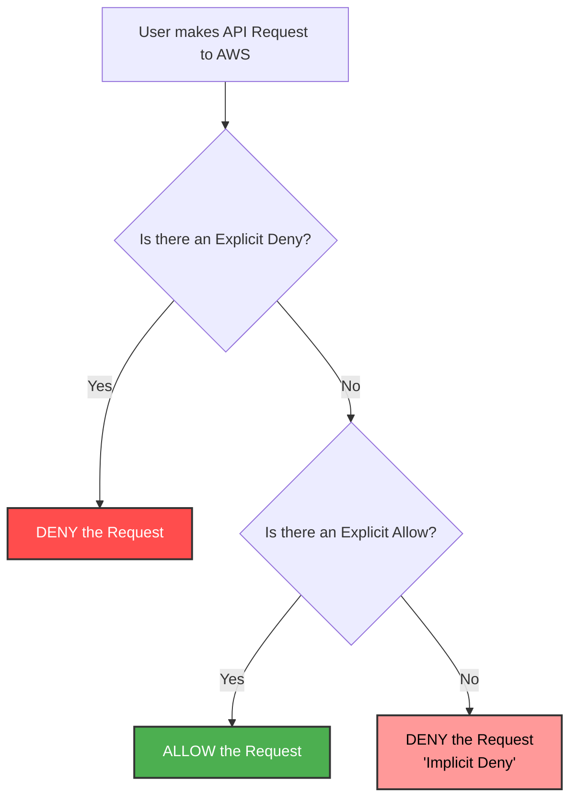

# 2.3 Authorization 🛡️

Welcome to Section 2.3! Now that AWS knows *who* you are (Authentication), it needs to decide *what* actions you are permitted to perform. This is Authorization.

---

## 🎯 Learning Objectives
By the end of this section, you will be able to:
- Understand the IAM Policy Evaluation Logic.
- Differentiate between Explicit Allow, Explicit Deny, and Implicit Deny.
- Predict the outcome of overlapping IAM policies.

---

## 📚 Detailed Topic Coverage

### IAM Policy Evaluation Logic
When an authenticated user makes a request to AWS (e.g., "I want to delete an S3 bucket"), AWS goes through a strict decision-making process to evaluate the attached IAM policies and determine if the action should be allowed or denied.

AWS evaluates policies based on three core rules, in a very specific order of precedence:

1. **Implicit Deny (The Default):**
   - By default, all requests are implicitly denied. If a user has no policies attached to them, they can do absolutely nothing in AWS. 
   - *Analogy:* If you don't have a ticket, you cannot enter the movie theater.

2. **Explicit Allow:**
   - If an IAM policy attached to the user has an `Effect: Allow` for the requested action, the implicit deny is overridden. The user is allowed.
   - *Analogy:* You show your ticket, the usher says "Yes, you can enter."

3. **Explicit Deny (The Trump Card 🃏):**
   - If ANY policy attached to the user has an `Effect: Deny` for the requested action, it **overrides any and all Allows**. 
   - An Explicit Deny is final. It cannot be bypassed.
   - *Analogy:* Even if you have a valid ticket (Allow), if your name is on the theater's banned list (Explicit Deny), you cannot enter.

### Evaluation Summary
`Explicit Deny` **>** `Explicit Allow` **>** `Implicit Deny`

---

## 🏗️ Architecture / Diagrams

---

## 💡 Real-World Analogies

**The Nightclub Analogy:**
- **Implicit Deny:** You walk up to a VIP nightclub. The default rule is that strangers off the street cannot walk in. You are implicitly denied.
- **Explicit Allow:** You show the bouncer your VIP pass. This is an explicit allow. You are granted entry.
- **Explicit Deny:** You have your VIP pass (Allow), but you get drunk and start a fight. The bouncer puts you on the "Banned List" (Explicit Deny). The next day, even though you show your VIP pass, the Banned List overrides it. You are denied entry.

---

## 🛠️ Practical Examples

Let's look at how AWS evaluates real scenarios.

### Scenario A
- Policy 1 attached: `Allow s3:GetObject`
- Policy 2 attached: `Allow s3:PutObject`
- Request: User tries to `DeleteObject`.
- **Result:** **DENIED** (Implicit Deny). There is no policy explicitly allowing deletion.

### Scenario B
- Policy 1 attached: `Allow s3:*` (Full S3 Access)
- Request: User tries to `DeleteObject`.
- **Result:** **ALLOWED** (Explicit Allow overrides Implicit Deny).

### Scenario C
- Policy 1 attached: `Allow s3:*` (Full S3 Access)
- Policy 2 attached: `Deny s3:DeleteObject`
- Request: User tries to `DeleteObject`.
- **Result:** **DENIED** (Explicit Deny overrides Explicit Allow).
- Request: User tries to `GetObject`.
- **Result:** **ALLOWED** (Explicit Allow covers it, and there is no explicit deny for GetObject).

---

## ❓ Doubts Discussed

> **Student:** "If I have AdministratorAccess (which allows everything) but someone attaches an inline policy denying S3 access, what happens?"
**Rajesh:** "You will be denied access to S3. AdministratorAccess is an Explicit Allow for everything. However, the Explicit Deny on S3 always wins. You will still have admin access to EC2, RDS, etc., but S3 will be blocked."

> **Student:** "Do I need to explicitly deny actions to prevent a user from doing something?"
**Rajesh:** "No! Because of Implicit Deny, if you don't grant permission, they can't do it. You only use Explicit Deny to override broad 'Allow' policies (e.g., granting full S3 access, but explicitly denying deletion)."

---

## ⚠️ Common Mistakes
❌ **Mistake:** Forgetting that Explicit Deny always wins, causing confusion when a user has "Full Access" but is still getting permission errors.
❌ **Mistake:** Writing policies with hundreds of explicit denies instead of simply relying on the default Implicit Deny.

---

## 📝 Key Takeaways
- **Implicit Deny:** Default state. No permissions exist.
- **Explicit Allow:** Grants permission, overriding implicit deny.
- **Explicit Deny:** Blocks permission, overriding ALL allows. It is the absolute final word.

---

## 🎤 Interview Questions

### 🟢 Basic

1. What happens if an IAM user has no policies attached to them?

They are subject to an Implicit Deny and will have zero access to any AWS resources.

2. Between an Explicit Allow and an Explicit Deny, which one takes precedence?

An Explicit Deny always takes precedence over an Explicit Allow.

### 🟡 Intermediate

3. Why would you use an Explicit Deny if Implicit Deny is the default?

Explicit Deny is useful when you have a broad Allow policy (like `s3:*`) but want to restrict a specific action (like `s3:DeleteBucket`). It acts as a safety guardrail.

### 🔴 Scenario-Based

4. User 'Alice' is in the 'Developers' group which has 'AmazonEC2FullAccess' (Allow). She is also in the 'Interns' group which has a custom policy that explicitly Denies 'ec2:TerminateInstances'. Can Alice terminate an EC2 instance?

No. When AWS evaluates her request, it sees the Explicit Allow from the Developers group, but it also sees the Explicit Deny from the Interns group. Because Explicit Deny always wins, her request to terminate the instance will be blocked.

---
*Ready for the next step? Proceed to [2.4 Root User](../2.04-Root-User/README.md)*
