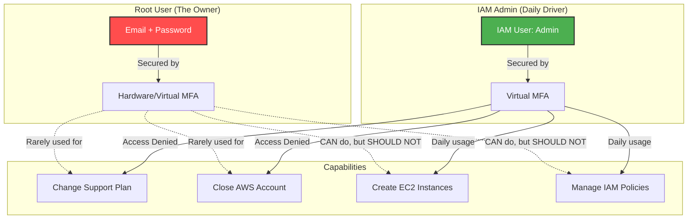

# 2.4 The Root User 👑

Welcome to Section 2.4! When you first sign up for an AWS account, you start with a single sign-in identity that has complete access to all AWS services and resources in the account. This identity is called the **AWS Account Root User**.

---

## 🎯 Learning Objectives
By the end of this section, you will be able to:
- Identify the characteristics and powers of the Root User.
- Understand the massive security risks associated with the Root User.
- Implement AWS Best Practices for securing the Root account.
- Know the daily usage limitations (when to use it vs when NOT to use it).

---

## 📚 Detailed Topic Coverage

### What is the Root Account?
The Root User is accessed by signing in with the email address and password that you used to create the AWS account. 
- It is the ultimate superuser of your AWS environment.
- It has **unrestricted, full access** to every single resource, billing information, and security setting.
- **Crucial Fact:** Root user permissions CANNOT be restricted by IAM policies. Even if you write an IAM policy explicitly denying access to the root user, it will be ignored. The root user is above IAM.

### Risks of the Root User
Because of its absolute power, the Root User is the biggest security vulnerability in your AWS account.
- If a malicious actor compromises your root email and password, they own your entire AWS environment.
- They can delete all your infrastructure, terminate all databases, change the support plan, or run up a massive bill by mining cryptocurrency.
- Since IAM policies can't restrict it, there is no "blast radius" containment.

### Security Best Practices for the Root User
AWS strongly recommends following these practices immediately upon creating an account:
1. **Enable MFA (Multi-Factor Authentication) immediately.** This is the most critical step.
2. **Never use the root user for daily tasks.** Even administrative tasks.
3. **Create an IAM Admin User.** Create a separate IAM user, give it `AdministratorAccess`, and use that for daily admin tasks.
4. **Never create Access Keys for the root user.** Root user access keys cannot be restricted. If they leak, your account is compromised.
5. **Use a highly complex, unique password.** Use a password manager and ensure the email associated with the root account is also highly secure and protected by MFA.

### When SHOULD you use the Root User?
You should lock away the root credentials and only bring them out for specific account-level tasks that *only* the root user can perform. These include:
- Changing account settings (account name, email address, root password).
- Restoring IAM user permissions (if the only IAM Admin accidentally deletes their own permissions).
- Activating IAM access to the Billing and Cost Management console.
- Changing your AWS Support plan.
- Closing the AWS account.

---

## 🏗️ Architecture / Diagrams

---

## 💡 Real-World Analogies

**The Master Key Analogy:**
- The **Root User** is the "Master Key" to a highly secure bank vault. It can open every safe, change the locks, and even sell the bank building. You don't use the Master Key every day to open the front door. You lock it in a secure safe and only use it in absolute emergencies.
- The **IAM Admin User** is the "Manager Key". It can do almost everything (open doors, manage staff), but it can't sell the building or change the Master Key. This is what you use daily.

---

## 🛠️ Practical / Hands-On

**Step-by-Step: Securing your Root User**
1. Log into the AWS Console using your root email address.
2. Go to IAM Dashboard.
3. You will see a security warning: **"Add MFA to root user"**.
4. Click "Add MFA".
5. Choose "Authenticator app".
6. Open your authenticator app (Authy/Google Auth) on your phone.
7. Scan the QR code.
8. Enter the two consecutive codes.
9. *Best Practice Check:* Now create an IAM User with `AdministratorAccess`, set a password for it, log out of Root, and log back in as the new IAM Admin.

---

## ❓ Doubts Discussed

> **Student:** "Can I restrict the root user's access using AWS Organizations Service Control Policies (SCPs)?"
**Rajesh:** "Excellent question! Yes, while IAM policies cannot restrict a root user, an SCP in AWS Organizations *can* restrict the root user of a member account. However, it cannot restrict the root user of the management (master) account."

> **Student:** "What happens if I lose my root account MFA device?"
**Rajesh:** "You have to go through a recovery process. You must click 'Troubleshoot MFA' at login, verify your identity via the registered email, and then AWS will call the registered phone number on the account. If you lose access to both the email and phone, you will have a very difficult time recovering the account via AWS Support."

---

## ⚠️ Common Mistakes
❌ **Mistake:** Generating Access Keys for the root user and using them in the AWS CLI.
❌ **Mistake:** Sharing the root user password among team members.
❌ **Mistake:** Leaving the root account without MFA enabled.

---

## 📝 Key Takeaways
- Root User = Ultimate power. Cannot be restricted by IAM.
- Always enable MFA on the Root User.
- Do NOT use the Root User for daily tasks. Create an IAM Admin instead.
- Only use Root for account closures, support plan changes, and billing setup.

---

## 🎤 Interview Questions

### 🟢 Basic

1. Can you restrict the permissions of the AWS Root User using an IAM Policy?

No, IAM policies cannot restrict the permissions of the Root User. The root user bypasses all IAM policy checks.

2. What is the very first security step you should take after creating a new AWS account?

Enable Multi-Factor Authentication (MFA) on the Root User account.

### 🟡 Intermediate

3. Name two tasks that ONLY the Root User can perform.

1. Closing the AWS account. 
2. Changing your AWS Support plan. (Also: Modifying account name/email, restoring IAM admin access).

### 🔴 Scenario-Based

4. You are hired as a DevOps engineer for a startup. The CEO hands you the email and password they used to create the AWS account so you can start provisioning servers. What should you do?

I should immediately log in, create a separate IAM User for myself with the necessary administrative permissions, and configure MFA for my IAM user. I would then advise the CEO to change the root password, enable MFA on the root account, lock away the root credentials, and never share them again. I will then log out of root and proceed with my daily tasks using my new IAM user.

---
*Ready for the next step? Proceed to [2.5 IAM Users](../2.05-IAM-Users/README.md)*
