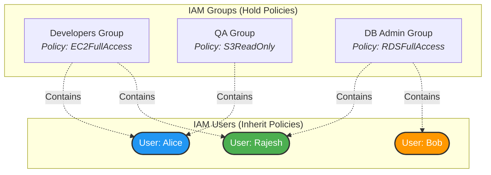

# 2.6 IAM Groups 👥

Welcome to Section 2.6! As your AWS environment grows, managing permissions for dozens or hundreds of individual IAM users becomes a nightmare. This is where **IAM Groups** come to the rescue.

---

## 🎯 Learning Objectives
By the end of this section, you will be able to:
- Understand the purpose and benefits of IAM Groups.
- Explain the concept of Group Inheritance.
- Identify the limitations of IAM Groups (e.g., no nested groups).
- Design a scalable permission model using Groups instead of inline user policies.

---

## 📚 Detailed Topic Coverage

### Why Use IAM Groups?
An IAM Group is a collection of IAM users. Groups let you specify permissions for multiple users at once. 
Instead of attaching policies directly to `user-A`, `user-B`, and `user-C`, you create a group called `Developers`, attach the policies to the group, and place the users inside it.

**Benefits:**
- **Easier Management:** If a new developer joins, you just add them to the `Developers` group, and they instantly get all the right access.
- **Consistency:** Ensures everyone in the same role has the exact same permissions, reducing human error.
- **Cleaner Auditing:** It's easier to audit the permissions of 3 groups than 50 individual users.

### Group Inheritance
Users inside a group automatically **inherit** all the policies attached to that group. 
- If a user is removed from a group, they instantly lose those inherited permissions.
- **Additive Permissions:** A user can belong to multiple groups. If User X is in `Developers` (S3 Access) and `DBAdmins` (RDS Access), User X gets BOTH S3 and RDS access.

### ⚠️ Critical Rule: No Nested Groups
In some operating systems (like Active Directory), you can put groups inside other groups. **AWS DOES NOT ALLOW THIS.**
- You **cannot** put an IAM Group inside another IAM Group.
- Groups only contain Users.

---

## 🏗️ Architecture / Diagrams

**Permission Breakdown from Diagram:**
- **Rajesh** is in Devs and DBAs. He has `EC2FullAccess` AND `RDSFullAccess`.
- **Alice** is in Devs and QA. She has `EC2FullAccess` AND `S3ReadOnly`.
- **Bob** is only in DBA. He has `RDSFullAccess`.

---

## 💡 Real-World Analogies

- **IAM Policies attached directly to a user:** Giving a specific employee (Rajesh) the physical keys to the server room, the storage closet, and the front door. If Rajesh leaves, you have to track down every key.
- **IAM Policies attached to a Group:** Giving keys to a "Role Badge" (e.g., The 'Manager' Badge). The badge has keys to all the rooms. When Rajesh is promoted to Manager, you simply hand him a Manager Badge. When he switches roles, you take the badge back. You manage the badge, not the person.

---

## 🛠️ Practical / Hands-On

**Scenario:** We will create a `CloudAdmins` group, attach administrator access, and add our user.

1. Go to AWS Console > IAM Dashboard.
2. Click **User groups** on the left pane > **Create group**.
3. Group name: `CloudAdmins`
4. Under **Add users to the group**, search and select `developer-rajesh` (from previous lab).
5. Under **Attach permission policies**, search for `AdministratorAccess` and check the box.
6. Click **Create group**.

*Verification:*
If you look at the user `developer-rajesh`, they now have `AdministratorAccess` inherited from the group, even though we didn't attach it directly to the user!

---

## ❓ Doubts Discussed

> **Student:** "Can a user have policies attached directly to them AND inherit policies from a group?"
**Rajesh:** "Yes! A user's total permissions are the union of all policies attached directly to them PLUS all policies inherited from their groups. However, best practice is to avoid attaching policies directly to users to keep things organized."

> **Student:** "Can I create a 'Senior Developers' group inside my 'Developers' group?"
**Rajesh:** "No. AWS does not support nested groups. You would have to create a separate 'Senior Developers' group and assign users to it alongside the 'Developers' group."

---

## ⚠️ Common Mistakes
❌ **Mistake:** Trying to nest groups (Group within a Group). AWS will simply throw an error.
❌ **Mistake:** Managing permissions by attaching policies directly to 100 individual users instead of using groups. (This leads to "permission drift" where users end up with slightly different access).
❌ **Mistake:** Assuming a group is an identity that can log in. (Groups cannot log in, they don't have credentials. Only Users log in).

---

## 📝 Key Takeaways
- Groups contain Users, NOT other groups.
- Users can belong to multiple groups.
- Users inherit all policies from all groups they belong to.
- Best practice: Assign permissions to Groups, and assign Users to Groups.

---

## 🎤 Interview Questions

### 🟢 Basic

1. Does AWS IAM support nested groups?

No, AWS IAM does not support placing a group inside another group.

2. Can an IAM user belong to multiple IAM groups at the same time?

Yes, a user can belong to multiple groups and will inherit the permissions from all of them.

### 🟡 Intermediate

3. What is the best practice for granting permissions to 50 new developers joining your company?

You should create an IAM Group called 'Developers', attach the necessary IAM policies (e.g., EC2 and S3 access) to that group, and then add all 50 users to the group. You should not attach policies directly to individual users.

### 🔴 Scenario-Based

4. User 'John' has an inline policy attached directly to his user account granting him 'S3ReadOnlyAccess'. He is also placed in the 'DataEngineers' group, which has 'S3FullAccess' attached. What is John's effective permission on S3?

John has 'S3FullAccess'. Permissions are additive. AWS evaluates all policies attached directly to the user and inherited from groups. Since the group grants explicit Allow for Full Access (and assuming there are no explicit Denys), he gets full access.

---
*Ready for the next step? Proceed to [2.7 IAM Policies](../2.07-IAM-Policies/README.md)*
