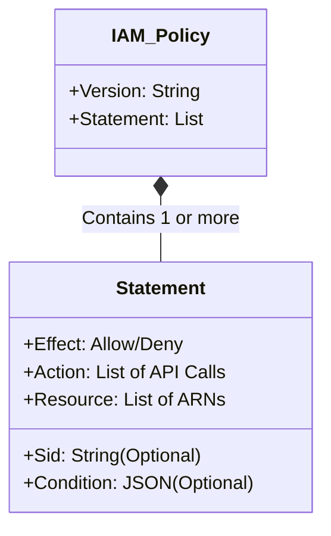

# 2.7 IAM Policies 📜

Welcome to Section 2.7! IAM Policies are the core mechanism that defines permissions in AWS. They are written in JSON (JavaScript Object Notation) and attached to identities (Users, Groups, Roles).

---

## 🎯 Learning Objectives
By the end of this section, you will be able to:
- Differentiate between Managed Policies, Inline Policies, and Customer Managed Policies.
- Understand the complete structure of an IAM JSON policy.
- Explain every element in a policy (Version, Statement, Effect, Action, Resource, Condition).

---

## 📚 Detailed Topic Coverage

### Types of IAM Policies

| Policy Type | Description | Reusable? | Managed By |
| :--- | :--- | :---: | :--- |
| **AWS Managed Policy** | Pre-built policies created by AWS (e.g., `AdministratorAccess`, `AmazonS3ReadOnlyAccess`). Best for quick setups. | ✅ Yes | AWS |
| **Customer Managed Policy** | Custom policies you create in your account. You can attach them to multiple users/groups. Best for custom granular access. | ✅ Yes | You |
| **Inline Policy** | A policy embedded directly into a single User, Group, or Role. It maintains a strict 1-to-1 relationship. If you delete the identity, the policy is deleted with it. | ❌ No | You |

*Note: AWS recommends using Managed Policies over Inline Policies whenever possible for easier auditing.*

### JSON Policy Structure

AWS IAM policies are written in JSON format. A policy consists of an overarching `Version` and a list of `Statement` blocks. Let's break down a complete example:

```json
{
  "Version": "2012-10-17",
  "Statement": [
    {
      "Sid": "AllowReadAccessToS3Bucket",
      "Effect": "Allow",
      "Action": "s3:GetObject",
      "Resource": "arn:aws:s3:::my-company-bucket/*",
      "Condition": {
        "IpAddress": {
          "aws:SourceIp": "192.168.1.0/24"
        }
      }
    }
  ]
}
```

### Breaking Down the Fields

1. **Version:** 
   - Specifies the language syntax rules that are to be used to process a policy. 
   - **Always use `"2012-10-17"`**. (We will discuss this in detail in the next section).
   
2. **Statement:**
   - The main container for the policy elements. A policy can have one or multiple statements (as a JSON array `[]`).

3. **Sid (Statement ID):**
   - *Optional.* A descriptive identifier for the statement. (e.g., `"AllowS3Read"`).

4. **Effect:**
   - **Required.** Specifies whether the statement results in an `"Allow"` or an explicit `"Deny"`.

5. **Action:**
   - **Required.** Describes the specific API operation(s) that will be allowed or denied.
   - Format: `service:operation` (e.g., `"s3:GetObject"`, `"ec2:StartInstances"`).
   - Supports wildcards (e.g., `"s3:*"` for all S3 actions).

6. **Resource:**
   - **Required.** Specifies the exact object or resource that the statement covers.
   - You must use ARNs (Amazon Resource Names).
   - Example: `"arn:aws:s3:::my-company-bucket/*"` means all objects inside that specific bucket.

7. **Condition:**
   - *Optional.* Defines the circumstances under which the policy grants permission.
   - Example: Only allow access if the user's IP address matches a corporate network, or if MFA is present.

---

## 🏗️ Architecture / Diagrams



---

## 💡 Real-World Analogies

**The Permission Slip Analogy:**
Think of a JSON policy as a school permission slip for a field trip.
- **Effect (Allow):** "My child is ALLOWED..."
- **Action (s3:GetObject):** "...to RIDE the bus and VISIT the museum..."
- **Resource (arn...):** "...specifically the Natural History Museum..."
- **Condition (IpAddress):** "...ONLY IF they are accompanied by a teacher."

---

## 🛠️ Practical / Hands-On

**Reviewing a Managed Policy:**
1. Go to IAM Dashboard > **Policies**.
2. Search for `AmazonEC2ReadOnlyAccess`.
3. Click on the policy name to open it.
4. Click on the **JSON** tab.
5. You will see something like this:
```json
{
    "Version": "2012-10-17",
    "Statement": [
        {
            "Effect": "Allow",
            "Action": "ec2:Describe*",
            "Resource": "*"
        }
    ]
}
```
*Notice how it uses `ec2:Describe*` to allow all EC2 actions that start with "Describe", and `*` as the Resource to mean "all EC2 resources in the account".*

---

## ❓ Doubts Discussed

> **Student:** "Can I attach a Customer Managed Policy to an S3 bucket?"
**Rajesh:** "No. S3 buckets use *Resource-Based Policies* (specifically called S3 Bucket Policies). The policies we are talking about here are *Identity-Based Policies* which are attached to IAM Users, Groups, and Roles. The JSON structure is identical, but *where* you attach them differs."

> **Student:** "If I delete a user who has an Inline Policy, what happens to the policy?"
**Rajesh:** "The inline policy is permanently deleted along with the user. This is why Customer Managed Policies are better—if you delete the user, the Managed Policy remains in your account to be used later."

---

## ⚠️ Common Mistakes
❌ **Mistake:** Forgetting the comma between JSON elements, resulting in syntax errors.
❌ **Mistake:** Using `"Resource": "*"` for powerful actions (like deleting buckets) instead of specifying the exact ARN. This gives the user power to delete ANY bucket in the account.
❌ **Mistake:** Confusing `Action` (the verb, e.g., s3:GetObject) with `Resource` (the noun, e.g., the specific bucket ARN).

---

## 📝 Key Takeaways
- Policies are written in JSON.
- **AWS Managed Policies** are pre-built by AWS.
- **Customer Managed Policies** are built by you and are reusable.
- **Inline Policies** are tied 1:1 to an identity.
- Core JSON elements: Effect (Allow/Deny), Action (API call), Resource (ARN).

---

## 🎤 Interview Questions

### 🟢 Basic
<details>
<summary>1. In an IAM JSON policy, what is the difference between Effect and Action?</summary>
Effect dictates whether the request will be an "Allow" or a "Deny". Action specifies the exact AWS API operation the policy is referring to (e.g., s3:PutObject).
</details>

<details>
<summary>2. What is an Inline Policy?</summary>
An inline policy is an IAM policy that is embedded directly into a single IAM user, group, or role. It cannot be shared with other identities and is deleted when the identity is deleted.
</details>

### 🟡 Intermediate
<details>
<summary>3. Why does AWS recommend using Managed Policies instead of Inline Policies?</summary>
Managed policies are reusable, easier to audit, support versioning (so you can rollback changes), and centralize permission management. Inline policies lack versioning and must be managed on a strict per-identity basis, making scaling difficult.
</details>

### 🔴 Scenario-Based
<details>
<summary>4. You wrote a policy with Action: 's3:*' and Resource: 'arn:aws:s3:::financial-data'. A developer complains they can't upload files to the 'marketing-data' bucket. Why?</summary>
The Resource block explicitly limits the 's3:*' actions strictly to the 'financial-data' bucket. Even though they have all S3 actions allowed, the scope is locked to that one specific resource. To fix it, you must add the ARN of the 'marketing-data' bucket to the Resource array.
</details>

---
*Ready for the next step? Proceed to [2.8 Version Field](../2.08-Version-Field/README.md)*
