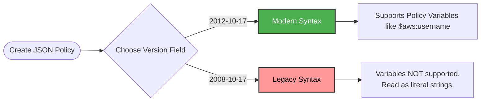

# 2.8 Version Field 📅

Welcome to Section 2.8! When looking at an IAM JSON Policy, the very first line is almost always `"Version": "2012-10-17"`. It is one of the most misunderstood fields by AWS beginners.

---

## 🎯 Learning Objectives
By the end of this section, you will be able to:
- Explain what the `Version` field in a JSON policy actually represents.
- Know the difference between `"2012-10-17"` and `"2008-10-17"`.
- Avoid the most common misconception about policy versioning.

---

## 📚 Detailed Topic Coverage

### What is the Version Field?
The `Version` policy element specifies the **language syntax rules** that AWS should use to parse and evaluate the policy. 
It tells AWS, *"Hey, read this JSON document using the grammar rules from this specific date."*

### Supported Versions
AWS currently supports two versions of the IAM policy language:

1. **`"2012-10-17"` (Current and Recommended) ✅**
   - This is the latest version of the policy language.
   - You should **always** use this for all new policies.
   - It supports advanced features, most notably **Policy Variables** (e.g., `${aws:username}`).

2. **`"2008-10-17"` (Legacy) ❌**
   - This was an older version of the policy language.
   - It is still supported for backward compatibility with very old policies.
   - **It DOES NOT support Policy Variables.** If you try to use a variable with this version, AWS will treat the variable as a literal string (which breaks your policy).

---

## 🏗️ Architecture / Diagrams

---

## 💡 Real-World Analogies

**The Dictionary Analogy:**
Imagine you are reading a book written in English.
- `"Version": "2012-10-17"` is like telling the reader to use a Modern English Dictionary. (They will understand modern slang).
- `"Version": "2008-10-17"` is like telling the reader to use a Shakespearean English Dictionary from the 1500s. If you use a modern slang word (like a Policy Variable), the reader won't understand it and will misinterpret the sentence.

---

## ❓ Doubts Discussed

> **Student:** "What is Version? Does it refer to policy versions like v1, v2, v3?"
**Rajesh:** "No! This is the most common mistake. The `Version` field inside the JSON strictly specifies the **IAM policy language version**. 
When you update a Customer Managed Policy in AWS, AWS creates a *Policy Version* (v1, v2, v3, up to 5 versions) to act as a backup in case you want to roll back. But the JSON `Version` field remains `"2012-10-17"` inside the code. They are two completely different concepts."

---

## ⚠️ Common Mistakes
❌ **Mistake:** Changing the version field to `"2024-01-01"` thinking it needs to be today's date. AWS will throw a syntax error. It must exactly be `"2012-10-17"`.
❌ **Mistake:** Changing the JSON Version field to `"v2"` or `"2"` to track updates to a policy.
❌ **Mistake:** Leaving the version as `"2008-10-17"` and wondering why Policy Variables (like mapping an S3 home directory to `${aws:username}`) are failing.

---

## 📝 Key Takeaways
- The `Version` field in JSON defines the IAM grammar/syntax rules.
- **Always** use `"2012-10-17"`.
- It does **not** track document revisions (v1, v2, v3).
- Only `"2012-10-17"` supports Policy Variables.

---

## 🎤 Interview Questions

### 🟢 Basic

1. What date should you always use in the Version field of a new IAM policy?

You should always use "2012-10-17".

2. Does the JSON Version field refer to the revision number (v1, v2) of the policy?

No. The Version field refers to the syntax/language version of IAM, not the document revision history.

### 🟡 Intermediate

3. What is the primary difference in features between policy version "2012-10-17" and "2008-10-17"?

The "2012-10-17" version supports Policy Variables (such as `${aws:username}`), whereas the older "2008-10-17" version does not.

### 🔴 Scenario-Based

4. You copied a policy from an old StackOverflow post. The policy is supposed to restrict users to their own S3 folder using the `${aws:username}` variable. However, when users try to access their folder, they get Access Denied. You look at the policy and see `"Version": "2008-10-17"`. What is the issue?

The issue is that version "2008-10-17" does not support Policy Variables. AWS is interpreting `${aws:username}` as a literal text string rather than dynamically inserting the user's name. Changing the Version to "2012-10-17" will enable variable evaluation and fix the issue.

---
*Ready for the next step? Proceed to [2.9 ARN](../2.09-ARN/README.md)*
