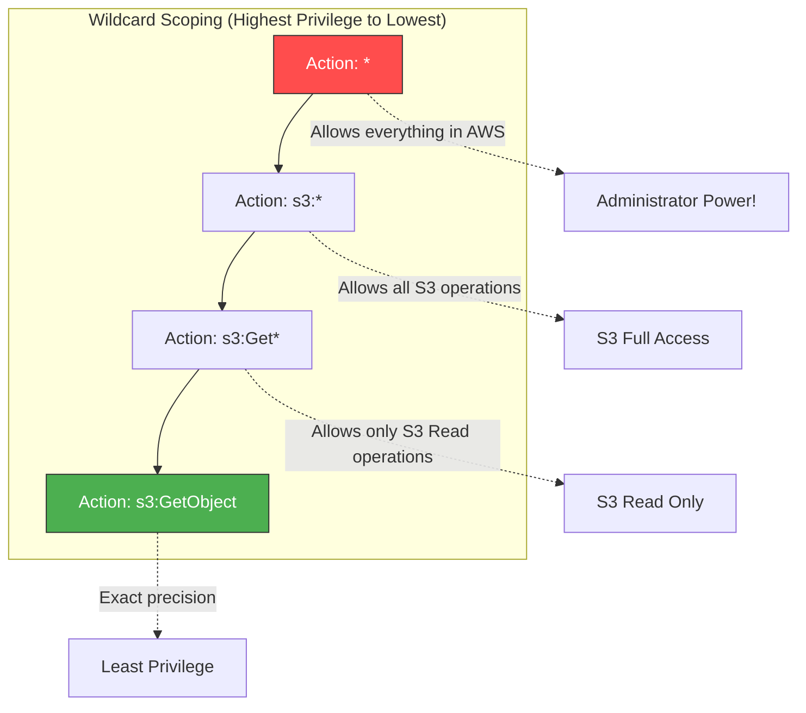

# 2.10 Actions ⚡

Welcome to Section 2.10! When defining an IAM Policy, you must specify exactly *what* the user is allowed (or denied) to do. These specific operations are called **Actions**.

---

## 🎯 Learning Objectives
By the end of this section, you will be able to:
- Understand the syntax format for Actions in IAM policies.
- Recognize common actions across core services like S3, EC2, and IAM.
- Utilize wildcards (`*`) to group actions safely.
- Understand the extreme danger of using the `*` action wildcard globally.

---

## 📚 Detailed Topic Coverage

### What are Actions?
Actions represent the specific API calls that a principal (user/role) can make against an AWS service. Every time you click a button in the AWS console, you are actually triggering one or more underlying Actions.

### Action Syntax
The format for an action is strictly:
`"service-prefix:operation"`

- **service-prefix:** The namespace of the AWS service (e.g., `s3`, `ec2`, `dynamodb`).
- **operation:** The specific API command (e.g., `GetObject`, `StartInstances`). Note that operations are case-sensitive and typically written in CamelCase.

### Common Service Actions

#### 🪣 Amazon S3
| Action | Description |
| :--- | :--- |
| `s3:GetObject` | Download/Read a file from a bucket. |
| `s3:PutObject` | Upload/Write a file to a bucket. |
| `s3:DeleteObject` | Delete a file from a bucket. |
| `s3:ListBucket` | View the names of files inside a bucket. |

#### 🖥️ Amazon EC2
| Action | Description |
| :--- | :--- |
| `ec2:DescribeInstances` | View the list of EC2 servers (Read-Only). |
| `ec2:StartInstances` | Turn on a stopped server. |
| `ec2:StopInstances` | Power down a running server. |
| `ec2:TerminateInstances` | Permanently delete a server. |

#### 👤 AWS IAM
| Action | Description |
| :--- | :--- |
| `iam:CreateUser` | Create a new IAM User. |
| `iam:AttachRolePolicy` | Attach permissions to a role. |
| `iam:PassRole` | Allow an AWS service (like EC2) to assume a role. |

### Using Wildcards (`*`)
AWS allows you to use the asterisk (`*`) wildcard to group multiple actions together, saving you from writing massive JSON arrays.

- **Service Level Wildcard:** `"s3:*"`
  - This grants access to EVERY action within the S3 service.
- **Prefix Wildcard:** `"s3:Get*"`
  - This grants access to all S3 actions that start with "Get" (e.g., `GetObject`, `GetBucketLocation`, `GetBucketPolicy`).
- **The Global Wildcard (DANGER):** `"*"`
  - This grants access to EVERY action across EVERY service in AWS. This is exactly what the `AdministratorAccess` managed policy uses. 

---

## 🏗️ Architecture / Diagrams



---

## 💡 Real-World Analogies

**The Restaurant Analogy:**
- `"service:operation"` -> `"kitchen:CookBurger"` (The chef is allowed to cook a burger).
- `"kitchen:Cook*"` (The chef is allowed to cook anything: burger, pasta, steak).
- `"kitchen:*"` (The chef can do anything in the kitchen: cook, clean, order supplies, fire the dishwasher).
- `"*"` (The chef owns the entire restaurant, can cook, fire the manager, and sell the building).

---

## 🛠️ Practical / Hands-On

Let's combine what we learned about Policies, ARNs, and Actions to write a highly secure JSON statement.
**Goal:** Allow a user to upload and download files, but NOT delete them, and only in a specific bucket called `data-lake`.

```json
{
  "Version": "2012-10-17",
  "Statement": [
    {
      "Effect": "Allow",
      "Action": [
        "s3:GetObject",
        "s3:PutObject"
      ],
      "Resource": "arn:aws:s3:::data-lake/*"
    }
  ]
}
```
*Notice how we used a JSON array `[]` for the Action field because we wanted to specify two distinct actions without using a broad wildcard.*

---

## ❓ Doubts Discussed

> **Student:** "Can I use wildcards in the service prefix, like `*:GetObject`?"
**Rajesh:** "Yes, you technically can. For example, `*:*` is valid (it's what admin uses). However, it is rarely useful or secure to cross service boundaries like that. Always define the specific service."

> **Student:** "If I use `s3:Get*`, does that allow listing the files in the bucket?"
**Rajesh:** "No! To list files, the API action is `s3:ListBucket`. Since it starts with 'List' and not 'Get', `s3:Get*` will not grant listing permissions. This is a very common certification exam trick!"

---

## ⚠️ Common Mistakes
❌ **Mistake:** Using `"Action": "*"` out of laziness when setting up developer accounts. This breaks the Principle of Least Privilege completely.
❌ **Mistake:** Assuming `s3:ListBucket` applies to objects (`arn:aws:s3:::bucket/*`). `ListBucket` is an action performed on the bucket itself, so the resource must be `arn:aws:s3:::bucket`.
❌ **Mistake:** Misspelling the Action (e.g., `s3:GetObjects` instead of `s3:GetObject`).

---

## 📝 Key Takeaways
- Format: `service:operation`.
- Wildcards (`*`) can be used to group operations (e.g., `ec2:Describe*`).
- `"*"` represents Administrator access. Avoid it unless absolutely necessary.
- Combine Actions with specific ARNs to achieve Least Privilege.

---

## 🎤 Interview Questions

### 🟢 Basic
<details>
<summary>1. What is the standard format for an IAM Action?</summary>
The format is `service-prefix:operation` (e.g., `s3:PutObject`).
</details>

<details>
<summary>2. What does the action 'ec2:Describe*' allow a user to do?</summary>
It allows the user to perform any EC2 API operation that begins with the word 'Describe', effectively granting read-only visibility into EC2 resources.
</details>

### 🟡 Intermediate
<details>
<summary>3. A developer has a policy with Action: 's3:Get*'. Why are they unable to see the list of files in the bucket via the AWS Console?</summary>
Because viewing the list of files requires the `s3:ListBucket` action. Since 'ListBucket' does not start with 'Get', it is not covered by the `s3:Get*` wildcard.
</details>

### 🔴 Scenario-Based
<details>
<summary>4. You are tasked with creating a policy for an automated backup script. The script only needs to upload `.zip` files to S3. A colleague suggests using Action: 's3:*'. Do you agree? Why or why not?</summary>
I disagree. Using 's3:*' violates the Principle of Least Privilege by granting the script the ability to delete buckets, change permissions, and read all data. I would write a policy explicitly granting only the `s3:PutObject` action, locked to the specific ARN of the backup bucket.
</details>

---
*Ready for the next step? Proceed to [2.11 Conditions](../2.11-Conditions/README.md)*
