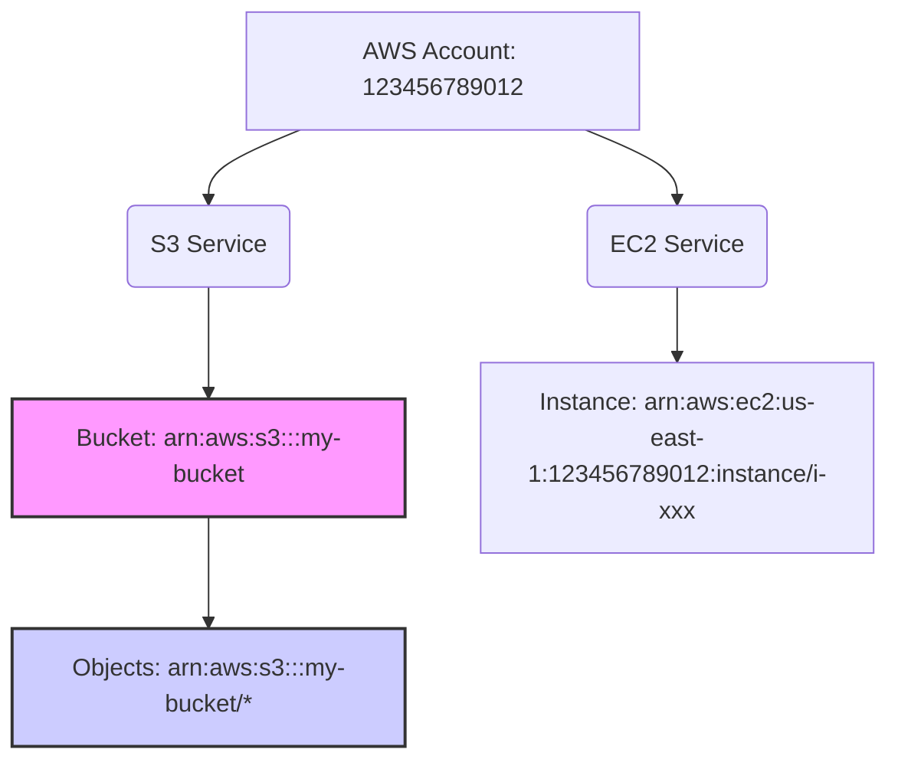

# 2.11 Resources in IAM Policies

## 🎯 Learning Objectives
- Understand the `Resource` element in IAM Policies.
- Differentiate between Bucket-level and Object-level resources.
- Learn how to specify exact AWS resources using ARNs.
- Identify common mistakes when assigning resources.

---

## 📚 Detailed Topic Coverage

In IAM, the **Resource** element specifies the exact AWS object(s) to which the permissions in the policy apply. When you define an action (e.g., `s3:GetObject`), you must define *where* that action can be performed.

### What is an ARN?
Amazon Resource Name (ARN) is a unique identifier for an AWS resource. It helps IAM unambiguously identify the exact resource across all of AWS.

**Standard ARN Format:**
`arn:partition:service:region:account-id:resource-type/resource-id`

### 🪣 Bucket-level vs Object-level ARNs (The S3 Example)

A very common area of confusion is the difference between a bucket itself and the objects inside it. Some actions operate on the bucket, and some operate on the objects.

| Resource Type | ARN Example | Applicable Actions |
|---------------|-------------|--------------------|
| **Bucket** | `arn:aws:s3:::my-company-bucket` | `s3:ListBucket`, `s3:CreateBucket`, `s3:DeleteBucket` |
| **Objects** | `arn:aws:s3:::my-company-bucket/*` | `s3:GetObject`, `s3:PutObject`, `s3:DeleteObject` |

### ⚠️ Common Mistakes

> [!WARNING]
> One of the most common mistakes is assigning an object-level action to a bucket-level ARN or vice-versa.

**❌ Incorrect:**
```json
{
  "Effect": "Allow",
  "Action": "s3:GetObject",
  "Resource": "arn:aws:s3:::my-company-bucket"
}
```
*Why?* `GetObject` reads a file (object), but the Resource provided is a bucket. This will result in an Access Denied error.

**✅ Correct:**
```json
{
  "Effect": "Allow",
  "Action": "s3:GetObject",
  "Resource": "arn:aws:s3:::my-company-bucket/*"
}
```

---

## 🏗️ Architecture: Resource Hierarchy



---

## 💡 Real-World Analogy

Think of an AWS service like a **Hotel**.
- **Service (`s3`)**: The entire hotel.
- **Bucket (`arn:aws:s3:::my-hotel`)**: A specific floor in the hotel.
- **Objects (`arn:aws:s3:::my-hotel/*`)**: The individual rooms on that floor.

If you have permission to walk the hallway (`ListBucket` on the floor), it doesn't mean you have the key to open the doors to the rooms (`GetObject` on the rooms). You need specific permissions for the objects!

---

## ❓ Doubts Discussed

> **Student:** "Can I specify multiple resources in one policy?"
> **Answer:** Yes! The `Resource` element can accept a JSON array of strings. You can include both the bucket and the objects to cover all bases if needed.

```json
"Resource": [
    "arn:aws:s3:::my-bucket",
    "arn:aws:s3:::my-bucket/*"
]
```

---

## 📝 Key Takeaways
📌 **ARN** is the fingerprint of any AWS resource.
📌 **Bucket ARNs** do not end in `/*`.
📌 **Object ARNs** end in `/*`.
📌 Always match the **Action** (bucket-level vs object-level) to the correct **Resource** ARN format.

---

## 🎤 Interview Questions

<details>
<summary><strong>Basic: What is an ARN in AWS?</strong></summary>
ARN stands for Amazon Resource Name. It is a standardized way to uniquely identify any AWS resource across all regions and accounts.
</details>

<details>
<summary><strong>Intermediate: Why would `s3:GetObject` on `arn:aws:s3:::my-bucket` fail?</strong></summary>
Because `s3:GetObject` is an object-level action, meaning it operates on files inside a bucket. However, the ARN `arn:aws:s3:::my-bucket` is a bucket-level ARN. The correct ARN must be `arn:aws:s3:::my-bucket/*`.
</details>

<details>
<summary><strong>Scenario-Based: A developer complains they can list the bucket but cannot download any files. Their policy has `Resource: arn:aws:s3:::app-data`. How do you fix it?</strong></summary>
The policy is missing the object-level permissions. I would update the `Resource` array to include `arn:aws:s3:::app-data/*` and ensure `s3:GetObject` is allowed.
</details>
