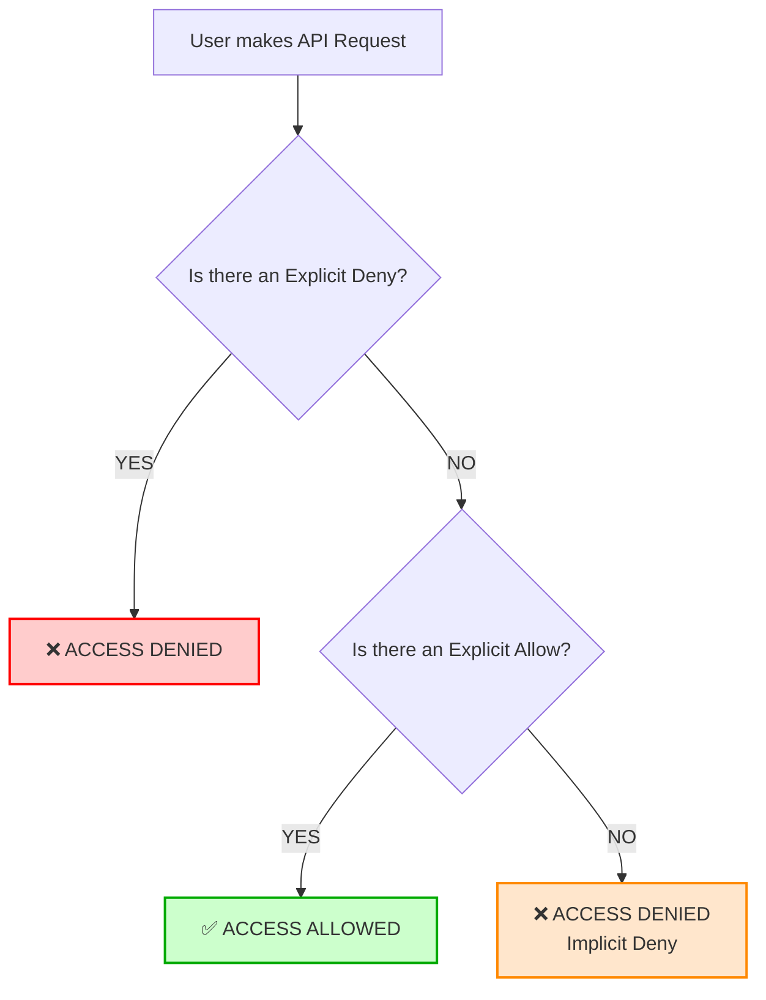

# 2.13 Explicit Deny and Policy Evaluation Logic

## 🎯 Learning Objectives
- Understand the AWS IAM Policy Evaluation Logic.
- Differentiate between Explicit Deny, Explicit Allow, and Implicit Deny.
- Grasp the golden rule of IAM: **Explicit Deny ALWAYS wins**.

---

## 📚 Detailed Topic Coverage

When an AWS user makes a request (e.g., trying to read an S3 bucket), AWS IAM evaluates all the policies attached to that user (and their groups/roles) to determine whether to allow or block the request.

### The 3 Outcomes of Policy Evaluation
1. **Explicit Deny**: A policy explicitly states `"Effect": "Deny"` for the action.
2. **Explicit Allow**: A policy explicitly states `"Effect": "Allow"` for the action.
3. **Implicit Deny**: No policy says Allow, and no policy says Deny. (This is the default state for everything in AWS).

### Evaluation Order

1. **Check for Explicit Deny:** IAM checks all policies. If even *one* policy has an Explicit Deny for the requested action, the request is immediately **DENIED**. Evaluation stops.
2. **Check for Explicit Allow:** If no Deny is found, IAM checks for an Explicit Allow. If found, the request is **ALLOWED**.
3. **Default:** If neither Deny nor Allow is found, the request defaults to **DENIED (Implicit Deny)**.

---

## 🏗️ Architecture: Policy Evaluation Logic Flowchart



---

## 💡 Real-World Analogy

Think of a VIP club entrance:
- **Implicit Deny**: You are not on the guest list. You cannot enter. (Default AWS state).
- **Explicit Allow**: You are on the VIP guest list. You can enter.
- **Explicit Deny**: You are on the Blacklist (Banned). Even if a promoter put you on the VIP guest list (Explicit Allow), the bouncer sees you on the Blacklist (Explicit Deny) and kicks you out. **The blacklist always wins.**

---

## 🛠️ Practical Example

**Scenario:** A user is assigned the `AdministratorAccess` managed policy (which grants Allow `*` on `*`). However, an inline policy is added to the user specifically denying S3 bucket deletion.

**Policy 1 (Administrator):**
```json
{
  "Effect": "Allow",
  "Action": "*",
  "Resource": "*"
}
```

**Policy 2 (Explicit Deny):**
```json
{
  "Effect": "Deny",
  "Action": "s3:DeleteBucket",
  "Resource": "*"
}
```

**Result:** The user can do *everything* in AWS, except delete S3 buckets. The Explicit Deny in Policy 2 overrides the Explicit Allow in Policy 1.

---

## ⚠️ Common Mistakes

> [!WARNING]
> Do not use Explicit Deny unless absolutely necessary (e.g., enforcing MFA, or strict boundary protection). It is very difficult to troubleshoot why a user is blocked if there are hidden explicit denies deep within group policies. Rely on Implicit Deny (just don't grant the permission) whenever possible.

---

## 📝 Key Takeaways
📌 **Default is Deny**: If you don't grant access, access is denied (Implicit).
📌 **Deny trumps Allow**: An Explicit Deny will ALWAYS override an Explicit Allow, regardless of how many Allow policies exist.
📌 **Evaluation is logical, not chronological**: It doesn't matter which policy was attached first.

---

## 🎤 Interview Questions

<details>
<summary><strong>Basic: What is the difference between an Implicit Deny and an Explicit Deny?</strong></summary>
An Implicit Deny means access is denied simply because no policy explicitly granted it. An Explicit Deny means a policy contains a specific `Effect: Deny` statement blocking the action.
</details>

<details>
<summary><strong>Intermediate: A user belongs to Group A which allows `s3:GetObject` and Group B which has an Explicit Deny on `s3:GetObject`. Can the user download the object?</strong></summary>
No. The Explicit Deny in Group B will always override the Explicit Allow in Group A, resulting in Access Denied.
</details>

<details>
<summary><strong>Scenario-Based: A developer has `AdministratorAccess` but keeps getting Access Denied when trying to terminate an EC2 instance. What is the most likely cause?</strong></summary>
Since the developer has an Explicit Allow for everything (`AdministratorAccess`), the only reason they would get Access Denied is if there is an Explicit Deny policy attached to them, their IAM Group, or via an SCP (Service Control Policy) at the Organization level blocking EC2 termination.
</details>
