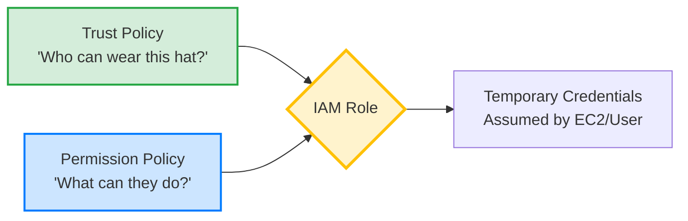

# 2.14 IAM Roles

## 🎯 Learning Objectives
- Understand why IAM Roles exist and their advantages over IAM Users.
- Comprehend the concept of Temporary Credentials.
- Learn about the different types of IAM Roles (Service, EC2, Lambda, Cross-Account).
- Understand the dual-policy nature of Roles (Trust vs Permission).

---

## 📚 Detailed Topic Coverage

An **IAM Role** is an IAM identity that you can create in your account that has specific permissions. However, unlike an IAM User, a role does not have long-term security credentials (passwords or access keys). Instead, when you assume a role, it provides you with **temporary security credentials** for your role session.

### Why Roles Exist?
The primary problem IAM Roles solve is the risk of exposed long-term credentials. If you hardcode Access Keys in an application running on EC2, anyone who accesses the server can steal those keys. Roles allow AWS services (like EC2) to request temporary keys dynamically, removing the need to manage and store long-term keys.

### Types of Roles

1. **Service Roles**: Roles assumed by an AWS service (e.g., API Gateway, CodeBuild) to perform actions on your behalf.
2. **EC2 Roles (Instance Profiles)**: A special type of service role attached to an EC2 instance, allowing applications running on it to make API requests.
3. **Lambda Roles (Execution Roles)**: Allows Lambda functions to read from S3, write to DynamoDB, or push logs to CloudWatch.
4. **Cross-Account Roles**: Allows users from Account A to securely access resources in Account B without creating new users in Account B.

### The Two Halves of an IAM Role

Every IAM Role consists of **TWO** policies:
1. **Trust Policy**: Defines *WHO* can assume the role (e.g., EC2, a specific IAM User, another AWS Account).
2. **Permission Policy**: Defines *WHAT* the role can do once assumed (e.g., read S3, write DynamoDB).

---

## 🏗️ Architecture: IAM Role Components

---

## 💡 Real-World Analogy

Think of an IAM Role as a **Security Guard Uniform (Hat/Badge)**.
- **Trust Policy**: Only employees listed on the roster are allowed to put on the uniform.
- **Permission Policy**: Once you wear the uniform, you are allowed to enter the control room and view security cameras.
- **Temporary Credentials**: At the end of your 8-hour shift, you must return the uniform (the credentials expire and rotate).

---

## ❓ Doubts Discussed

> **Student:** "Can I attach an IAM Role to an IAM User?"
> 
> **Answer:** You don't "attach" a role to a user. Instead, the user *assumes* the role using the STS `AssumeRole` API. The user temporarily drops their original permissions and takes on the permissions of the role.

---

## 📝 Key Takeaways
📌 Roles = Temporary Credentials.
📌 Never embed Access Keys in EC2 or source code; use Roles instead.
📌 A role is useless without a Trust Policy (which specifies who can assume it) AND a Permission Policy (which specifies what it can do).

---

## 🎤 Interview Questions

<strong>Basic: What is the main difference between an IAM User and an IAM Role?</strong>

An IAM User has long-term credentials (password, Access Keys) and represents a specific person or service. An IAM Role has temporary credentials that rotate automatically, and it is meant to be "assumed" by anyone or anything that needs it (and is trusted to do so).

<strong>Intermediate: How do IAM Roles improve security for applications running on EC2 instances?</strong>

They eliminate the need to hardcode or store long-term Access Keys on the EC2 instance. Instead, the application automatically requests temporary credentials via the Instance Metadata Service (IMDS), which are regularly rotated, drastically reducing the risk of credential theft.

<strong>Scenario-Based: You have an application running in Account A that needs to read an S3 bucket in Account B. How do you set this up?</strong>

I would create a Cross-Account IAM Role in Account B. 
1. The **Permission Policy** in Account B allows reading the S3 bucket.
2. The **Trust Policy** in Account B trusts Account A to assume the role.
3. The application in Account A calls `sts:AssumeRole` to get temporary credentials for Account B's role, and then reads the bucket.

