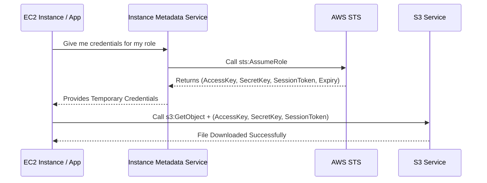

# 2.17 STS (Security Token Service)

## 🎯 Learning Objectives
- Understand what AWS STS is and its primary function.
- Identify the components of temporary credentials.
- Learn how credential expiration and rotation work.
- Understand the `sts:AssumeRole` API flow.

---

## 📚 Detailed Topic Coverage

AWS **STS (Security Token Service)** is the web service that enables you to request temporary, limited-privilege credentials for IAM users or for users that you authenticate (federated users). 

Whenever you deal with IAM Roles, you are interacting with STS behind the scenes.

### Anatomy of Temporary Credentials

Unlike long-term IAM User credentials (which have 2 parts), STS temporary credentials have **4 parts**:

1. **Access Key ID**: E.g., `ASIA...` (Notice it starts with ASIA instead of AKIA).
2. **Secret Access Key**: The secret pairing for the Access Key.
3. **Session Token**: A long string that validates the temporary session. **(Crucial difference!)**
4. **Expiration Time**: When the credentials will stop working (Default: 1 hour. Configurable: 15 mins to 12 hours).

### Credential Rotation
Because STS credentials expire, they must be refreshed. If you are using the AWS SDKs (Boto3, Node.js) or the AWS CLI on an EC2 instance, the SDK automatically handles the background polling of STS to rotate and renew credentials before they expire.

---

## 🏗️ Architecture: STS Assume Role Flow



---

## 🛠️ Verification Commands

You can verify who you are currently authenticated as (and whether you are using a role via STS) using the AWS CLI:

```bash
aws sts get-caller-identity
```

**Output when using an IAM User (Long-term):**
```json
{
    "UserId": "AIDAXXXXXXXXXXXXX",
    "Account": "123456789012",
    "Arn": "arn:aws:iam::123456789012:user/cli-user"
}
```

**Output when using an IAM Role (Temporary STS):**
```json
{
    "UserId": "AROAXXXXXXXXXXXXX:i-0abcd1234ef567890",
    "Account": "123456789012",
    "Arn": "arn:aws:sts::123456789012:assumed-role/EC2-S3-Role/i-0abcd1234ef567890"
}
```

---

## 📝 Key Takeaways
📌 **STS** provides temporary credentials.
📌 Temporary credentials start with **ASIA** and include a **Session Token**.
📌 Default expiration is 1 hour; AWS SDKs handle rotation automatically.
📌 The key API action is `sts:AssumeRole`.

---

## 🎤 Interview Questions

<details>
<summary><strong>Basic: What does STS stand for and what does it do?</strong></summary>
STS stands for Security Token Service. It is an AWS service used to generate temporary, short-lived security credentials to access AWS resources.
</details>

<details>
<summary><strong>Intermediate: You are reviewing code and see an Access Key starting with `ASIA...`. What does this indicate?</strong></summary>
It indicates that these are temporary credentials generated by STS, usually from assuming a role, and they must be accompanied by a Session Token to be valid. Long-term user keys start with `AKIA...`.
</details>

<details>
<summary><strong>Scenario-Based: Your application running on EC2 crashes after 1 hour with "Access Denied" errors, but it worked perfectly fine when it started. What is the most likely cause?</strong></summary>
The application might have hardcoded or cached the temporary STS credentials retrieved at startup without implementing logic to refresh them. When the default 1-hour expiration hit, the keys became invalid. The code should rely on the AWS SDK's default credential provider chain, which handles rotation automatically.
</details>
