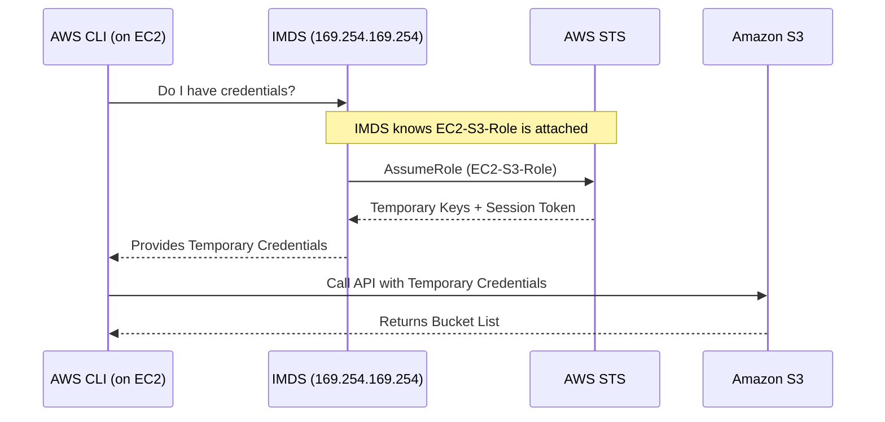

# 2.19 Practical — EC2 Role Instead of Access Keys (⭐⭐)

## 🎯 Objective
Understand how an EC2 instance accesses S3 **WITHOUT** storing Access Keys. This is the most critical practical in the IAM chapter, demonstrating AWS security best practices.

---

## 📖 The Story: The Insecure Way vs The Secure Way

### The Initial State (The Insecure Way)
Imagine we have an EC2 instance. A developer logged into the server, ran `aws configure`, and entered their long-term `AKIA...` keys.

```
EC2 Server → Access Key → Secret Key → S3
```

When they run `aws s3 ls`, it works. 
✅ Successfully listed buckets.

### Step 1: Removing the Credentials
Let's simulate securing the server. We will delete the hardcoded credentials.

```bash
# Delete the credentials file
rm ~/.aws/credentials
```

Now, try running the command again:
```bash
aws s3 ls
```
❌ **Error:** `Unable to locate credentials. You can configure credentials by running "aws configure".`

> **Student Question:** "There are no Access Keys now. We deleted them. How can this server possibly access S3 without running aws configure again?"

**Answer:** We use an IAM Role!

---

### Step 2: Create an IAM Role for EC2 (The Secure Way)
1. Go to the **IAM Console** → **Roles** → **Create role**.
2. **Trusted entity type**: AWS service.
3. **Use case**: EC2. (This creates the *Trust Policy* allowing EC2 to assume it). Click Next.
4. **Permissions policies**: Search for and attach `AmazonS3ReadOnlyAccess`. (This is the *Permission Policy*). Click Next.
5. **Role name**: `EC2-S3-Role`.
6. Click **Create role**.

### Step 3: Attach the Role to the EC2 Instance
1. Go to the **EC2 Console** → **Instances**.
2. Select your running instance.
3. Click **Actions** → **Security** → **Modify IAM role**.
4. From the dropdown, select `EC2-S3-Role`.
5. Click **Update IAM role**.

### Step 4: Test and Verify
Go back to the terminal on your EC2 instance (where we just deleted the credentials).

Run the command again:
```bash
aws s3 ls
```
✅ **It worked!** The buckets are listed, **WITHOUT** any Access Key or Secret Key stored on the instance!

---

## 🧠 Internal Working: How did that just happen?

When the AWS CLI ran `aws s3 ls`, it couldn't find `~/.aws/credentials`. So, it automatically fell back to asking the **Instance Metadata Service (IMDS)** if the server has a role attached.

Here is the exact flow:



### Verification
Let's prove that we are using temporary STS credentials:

```bash
aws sts get-caller-identity
```
**Output:**
```json
{
    "UserId": "AROAYBXXXXXXXXX:i-0abcd1234ef567890",
    "Account": "123456789012",
    "Arn": "arn:aws:sts::123456789012:assumed-role/EC2-S3-Role/i-0abcd1234ef567890"
}
```
Notice the ARN says `assumed-role/EC2-S3-Role/`. This confirms we are using STS and IAM Roles, not long-term keys!

---

## 📝 Key Learnings
- IAM Roles entirely eliminate the need for long-term Access Keys on EC2 instances.
- Credentials provided by roles are temporary and automatically rotated by AWS.
- The AWS SDK/CLI automatically queries the local IMDS (`169.254.169.254`) to retrieve these credentials.
- This is the industry standard for securing AWS compute resources.

---

## 🎤 Interview Questions (CRITICAL)

<details>
<summary><strong>1. Why should IAM Roles be preferred over Access Keys on EC2?</strong></summary>
Access keys are long-term credentials. If stored on an EC2 instance, they can be stolen and used indefinitely. IAM Roles provide temporary credentials that rotate automatically, significantly reducing the attack surface.
</details>

<details>
<summary><strong>2. What is STS?</strong></summary>
Security Token Service. It is the AWS service responsible for generating temporary, short-lived credentials.
</details>

<details>
<summary><strong>3. What are temporary credentials?</strong></summary>
They are short-lived authentication credentials consisting of an Access Key, Secret Key, a Session Token, and an Expiration Time.
</details>

<details>
<summary><strong>4. What is the Instance Metadata Service (IMDS)?</strong></summary>
IMDS is a local service running on a special IP address that provides information about the running EC2 instance to the instance itself, including networking info, tags, and temporary IAM Role credentials.
</details>

<details>
<summary><strong>5. How does an EC2 instance obtain credentials without `aws configure`?</strong></summary>
When a role is attached to the EC2 instance, the AWS SDK/CLI automatically queries the IMDS endpoint. IMDS handles calling STS to assume the role and passes the temporary credentials back to the SDK/CLI.
</details>

<details>
<summary><strong>6. What happens if the temporary credentials expire?</strong></summary>
The AWS SDK and CLI are designed to automatically detect when the keys are nearing expiration and will quietly poll IMDS/STS for a fresh set of credentials without application interruption.
</details>

<details>
<summary><strong>7. What is the IMDS endpoint IP address?</strong></summary>
`169.254.169.254` (This is a link-local address).
</details>

<details>
<summary><strong>8. What is the difference between IMDS v1 and v2?</strong></summary>
IMDSv1 uses a simple request-response model that can be vulnerable to SSRF (Server-Side Request Forgery) attacks. IMDSv2 is highly secure because it requires a session token to be requested via a PUT request before any data can be fetched via GET requests.
</details>

<details>
<summary><strong>9. How would you verify which identity an EC2 instance is currently using?</strong></summary>
By running the command `aws sts get-caller-identity`.
</details>

<details>
<summary><strong>10. Can you attach multiple IAM Roles to a single EC2 instance?</strong></summary>
No. You can only attach ONE IAM Role (Instance Profile) to an EC2 instance at a time. If the instance needs permissions for multiple services, you must attach multiple Permission Policies to that single Role.
</details>
