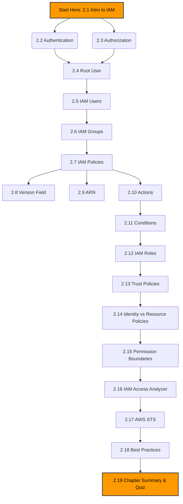

# Chapter 2: AWS Identity and Access Management (IAM) 🛡️

Welcome to **Chapter 2** of the *AWS Zero to Hero* handbook! In this chapter, we dive deep into the core of AWS Security: **Identity and Access Management (IAM)**. 

IAM is the front door to your AWS account. Understanding IAM is non-negotiable for anyone working with AWS, whether you are a Developer, SysOps Administrator, or Solutions Architect.

---

## 🎯 What You Will Learn
This chapter provides a comprehensive breakdown of IAM. By the end of this chapter, you will understand:
- How to secure your AWS environment using the Principle of Least Privilege.
- The differences between Authentication and Authorization.
- How to create and manage Users, Groups, and Roles.
- How to write, interpret, and troubleshoot IAM Policies using JSON.
- Core IAM concepts like ARNs, Actions, and Policy Evaluation Logic.

---

## 🏗️ Chapter Learning Path

---

## 📚 Section Index

Click on any section below to navigate directly to the detailed study guide, practicals, and interview questions for that topic.

| Section | Topic | Description |
| :--- | :--- | :--- |
| **2.01** | [Introduction to IAM](./2.01-Introduction-to-IAM/README.md) | What is IAM, Global Service, Least Privilege |
| **2.02** | [Authentication](./2.02-Authentication/README.md) | Passwords, MFA, Access & Secret Keys |
| **2.03** | [Authorization](./2.03-Authorization/README.md) | Policy Evaluation Logic, Allow vs Deny |
| **2.04** | [Root User](./2.04-Root-User/README.md) | Securing the master account, MFA, Best Practices |
| **2.05** | [IAM Users](./2.05-IAM-Users/README.md) | Console vs Programmatic Access, Password Policies |
| **2.06** | [IAM Groups](./2.06-IAM-Groups/README.md) | Group inheritance, permission management |
| **2.07** | [IAM Policies](./2.07-IAM-Policies/README.md) | Managed vs Inline policies, JSON structure |
| **2.08** | [Version Field](./2.08-Version-Field/README.md) | 2012-10-17 vs 2008-10-17, Grammar rules |
| **2.09** | [ARN (Amazon Resource Name)](./2.09-ARN/README.md) | Identifying AWS resources globally |
| **2.10** | [Actions](./2.10-Actions/README.md) | Service operations, wildcards (e.g., s3:GetObject) |
| **2.11** | [Conditions](./2.11-Conditions/README.md) | *Upcoming* |
| **2.12** | [IAM Roles](./2.12-IAM-Roles/README.md) | *Upcoming* |
| **2.13** | [Trust Policies](./2.13-Trust-Policies/README.md) | *Upcoming* |
| **2.14** | [Identity vs Resource Policies](./2.14-Identity-vs-Resource-Policies/README.md) | *Upcoming* |
| **2.15** | [Permission Boundaries](./2.15-Permission-Boundaries/README.md) | *Upcoming* |
| **2.16** | [IAM Access Analyzer](./2.16-IAM-Access-Analyzer/README.md) | *Upcoming* |
| **2.17** | [AWS STS](./2.17-AWS-STS/README.md) | *Upcoming* |
| **2.18** | [Best Practices](./2.18-Best-Practices/README.md) | *Upcoming* |
| **2.19** | [Summary & Quiz](./2.19-Summary-and-Quiz/README.md) | *Upcoming* |

---

## 🛠️ Prerequisites for this Chapter
Before starting this chapter, ensure you have:
1. Created an **AWS Free Tier Account**.
2. A basic understanding of Cloud Computing (Covered in Chapter 1).
3. Installed the **AWS CLI** on your local machine.

---
*Ready to become an AWS Security expert? Let's dive into [Section 2.01: Introduction to IAM](./2.01-Introduction-to-IAM/README.md)!*
