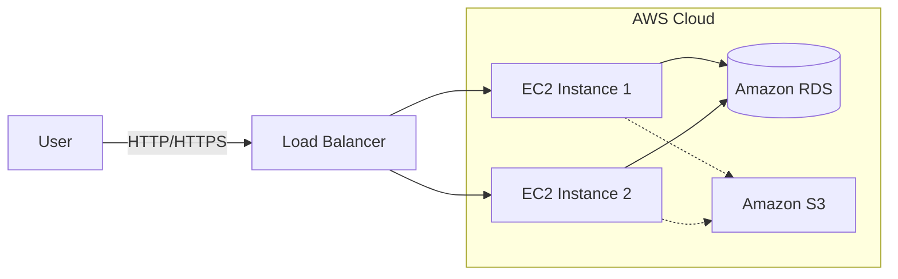

# 3.01 - Introduction to Amazon EC2

## 🎯 Learning Objectives
* Understand what Amazon EC2 is and why it's a foundational AWS service.
* Grasp the concept of "Elasticity" in cloud computing.
* Identify the primary use cases for EC2.
* Understand the different EC2 pricing models.

---

## 📚 Detailed Topic Coverage

### What is Amazon EC2?
**EC2 (Elastic Compute Cloud)** provides scalable, virtual servers in the AWS cloud. Instead of buying physical hardware, racking it, connecting power/network, and installing an OS, EC2 lets you click a button and have a virtual server ready in minutes. 

Think of it as renting a computer in an Amazon data center. You have complete control over it (root access), but you don't have to worry about the underlying hardware.

### Why is it called "Elastic"?
The "E" in EC2 stands for Elastic. Elasticity is the ability to automatically grow or shrink resources based on demand.
* **Scale Up/Down (Vertical):** Changing a small server to a big server (e.g., 2GB RAM to 16GB RAM).
* **Scale Out/In (Horizontal):** Adding more servers to a pool (e.g., from 2 servers to 10 servers during a spike, then back to 2).

### History
Launched in 2006, EC2 was one of the very first AWS services (along with S3 and SQS). It revolutionized the IT industry by introducing the "Infrastructure as a Service" (IaaS) model.

### 💰 EC2 Pricing Models

Understanding pricing is crucial for both architects and interviews.

| Pricing Model | Description | Use Case |
| :--- | :--- | :--- |
| **On-Demand** | Pay by the hour/second. No upfront commitment. Highest cost. | Short-term, unpredictable workloads. App development/testing. |
| **Reserved Instances (RI)** | Commit to 1 or 3 years. Up to 72% discount. | Steady-state, predictable usage (e.g., main database server). |
| **Spot Instances** | Bid on spare AWS capacity. Up to 90% discount. Can be terminated with 2-min notice! | Batch processing, ML training, stateless web tiers. |
| **Savings Plans** | Commit to a specific dollar amount per hour ($X/hour) for 1 or 3 years. Flexible across families/regions. | Modern alternative to RIs with more flexibility. |
| **Dedicated Hosts** | Physical server fully dedicated for your use. | Compliance requirements, BYOL (Bring Your Own License). |

---

## 🏗️ Architecture: EC2 in the AWS Ecosystem

---

## 💡 Real-World Analogy
Imagine you need a car:
* **On-Demand:** Renting an Uber. You pay only when you ride. It's more expensive per mile, but great if you only need it occasionally.
* **Reserved Instance:** Leasing a car for 3 years. You commit to a term, but the monthly cost is much cheaper.
* **Spot Instance:** A specialized standby taxi that is extremely cheap, but the driver can kick you out with a 2-minute warning if someone else pays full price.
* **Dedicated Host:** Buying the whole car manufacturing plant (kidding, it's like buying a private car that ONLY you can ever touch, even in the garage).

---

## ❓ Doubts Discussed (From Live Sessions)

> **Student:** Does AWS charge me if my EC2 instance is stopped?
> **Instructor:** You are NOT charged for the EC2 compute time when it's stopped. However, you ARE charged for the attached EBS volume (storage) and any Elastic IPs attached to it. 

> **Student:** Can a Spot Instance be converted to On-Demand so it doesn't get terminated?
> **Instructor:** No, you cannot directly convert a running Spot Instance to On-Demand. You would need to create an AMI (image) of it and launch a new On-Demand instance.

---

## ⚠️ Common Mistakes
* ❌ Leaving On-Demand instances running 24/7 for Dev/Test environments. (Use automation to stop them at night!)
* ❌ Using Spot Instances for critical databases. (Your database could be terminated at any moment!)
* ❌ Buying a 3-year Reserved Instance before testing if the instance type is correct.

---

## 📝 Key Takeaways
📌 EC2 provides virtual servers called "instances".
📌 You have full root/admin access.
📌 Elasticity means paying only for what you use and scaling dynamically.
📌 Spot instances are the cheapest but come with the risk of termination.

---

## 🎤 Interview Questions

<b>Basic: What is Amazon EC2?</b>

Amazon Elastic Compute Cloud (EC2) is a web service that provides secure, resizable compute capacity in the cloud. It allows users to rent virtual computers on which to run their own computer applications.

<b>Intermediate: Compare Reserved Instances vs. Savings Plans.</b>

Reserved Instances require you to commit to a specific instance family and region (e.g., m5 instances in us-east-1). Savings Plans are more flexible—you commit to a monetary spend (e.g., $10/hour), and you get the discount regardless of the instance family, size, or region you use, as long as you hit that spend.

<b>Scenario-Based: Your company runs a nightly batch processing job that takes 4 hours. It can be interrupted and resumed without data loss. Which pricing model should you choose to minimize costs?</b>

Spot Instances. Since the workload can handle interruptions and is temporary, Spot Instances will provide the maximum cost savings (up to 90%).

