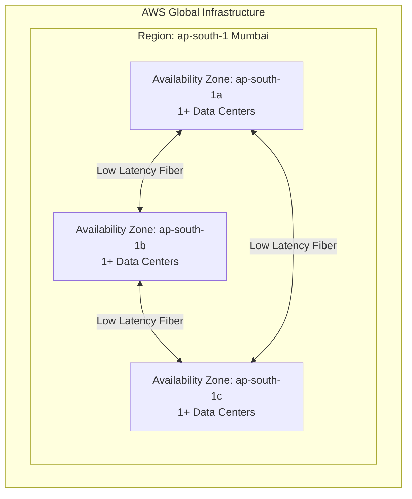

# 3.02 - Regions & Availability Zones

## 🎯 Learning Objectives
* Understand the global infrastructure of AWS.
* Differentiate between Regions, Availability Zones (AZs), and Edge Locations.
* Learn how to choose the right Region for your workloads.
* Understand the concept of Fault Tolerance using Multi-AZ architecture.

---

## 📚 Detailed Topic Coverage

### What is an AWS Region?
A **Region** is a physical, geographical location in the world where AWS has multiple data centers. 
* Examples: `us-east-1` (N. Virginia), `ap-south-1` (Mumbai), `eu-west-1` (Ireland).
* AWS has 30+ regions globally.
* **Isolation:** Each region is completely independent and isolated from others. Data does not leave a region unless you explicitly configure it to.

### What is an Availability Zone (AZ)?
An **Availability Zone (AZ)** consists of one or more discrete data centers within a region, housed in separate facilities with redundant power, networking, and connectivity.
* Examples: `us-east-1a`, `us-east-1b`, `us-east-1c`.
* Every region has at least 2 AZs (most have 3 or more).
* AZs in a region are interconnected with high-bandwidth, low-latency networking.

### Edge Locations
Edge Locations are AWS data centers designed to deliver services with the lowest latency possible. They are primarily used by CloudFront (CDN) to cache content closer to end-users. There are hundreds of edge locations globally.

### How to Choose an AWS Region?
When deploying your EC2 instances, you must choose a region based on:
1. **Latency:** Choose the region closest to your end-users for faster load times.
2. **Compliance / Data Sovereignty:** Legal requirements might dictate that user data must stay within a specific country's borders (e.g., GDPR in Europe).
3. **Cost:** Pricing varies by region (e.g., `us-east-1` is often cheaper than `ap-east-1`).
4. **Service Availability:** New AWS services usually launch in `us-east-1` first. Not all services are available in all regions immediately.

---

## 🏗️ Architecture: Region vs AZ

---

## 💡 Real-World Analogy
* **Region:** A City (e.g., Mumbai).
* **Availability Zone (AZ):** Different Power Grids/Neighborhoods within that City (e.g., Andheri, Bandra). If a flood takes out power in Andheri, Bandra is far enough away to likely still have power.
* **Multi-AZ Deployment:** Putting your application servers in both Andheri and Bandra. If one goes down, the other handles the traffic.

---

## ❓ Doubts Discussed

> **Student:** If I create an EC2 instance in `us-east-1`, can I see it when I switch my AWS Console to `ap-south-1`?
> **Instructor:** No. EC2 is a **Region-scoped** service. The AWS Console only shows resources for the currently selected region. This is a very common point of confusion for beginners!

> **Student:** Are AZ names the same for all AWS accounts?
> **Instructor:** No! `us-east-1a` in your account might map to a completely different physical data center than `us-east-1a` in my account. AWS shuffles these to distribute load evenly.

---

## ⚠️ Common Mistakes
* ❌ Deploying all instances in a single AZ. (If that AZ goes down, your whole app goes down).
* ❌ Choosing a region far from users, causing high latency.
* ❌ Thinking "Global" services (like IAM or Route53) are restricted to regions.

---

## 📝 Key Takeaways
📌 A Region has multiple AZs.
📌 An AZ has 1 or more data centers.
📌 Deploy across multiple AZs (Multi-AZ) for High Availability and Fault Tolerance.
📌 Most AWS services are Region-scoped.

---

## 🎤 Interview Questions

<b>Basic: What is the difference between a Region and an Availability Zone?</b>

A Region is a geographic area containing multiple isolated locations. An Availability Zone (AZ) is one of those isolated locations within a Region, consisting of one or more physical data centers.

<b>Intermediate: Why would you deploy an application in multiple AZs instead of just one?</b>

For High Availability (HA) and Fault Tolerance. If a natural disaster, power outage, or network failure takes down one AZ, the application will remain accessible from the instances running in the other AZ.

<b>Scenario-Based: Your client in Germany has strict data compliance laws stating user data cannot leave the EU. However, `us-east-1` is cheaper. Where do you deploy?</b>

You must deploy in an EU region (e.g., `eu-central-1` Frankfurt). Compliance and legal requirements always override cost optimizations.

