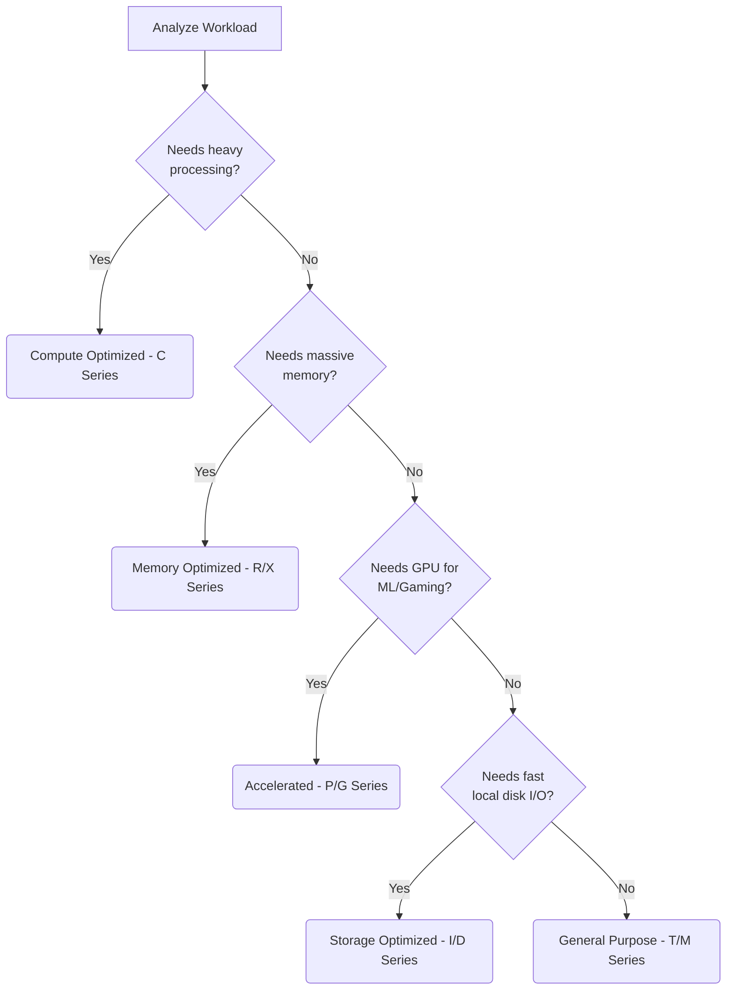

# 3.03 - EC2 Instance Types

## 🎯 Learning Objectives
* Understand what an EC2 instance type is.
* Decode the AWS instance naming convention.
* Differentiate between various Instance Families and their use cases.

---

## 📚 Detailed Topic Coverage

### What are Instance Types?
When you buy a laptop, you choose the CPU, RAM, and Storage. In AWS, you choose an **Instance Type**. An instance type defines the host computer's hardware specifications (vCPUs, Memory, Network performance).

### Decoding the Naming Convention
Example: `t3.micro`

* **t** = Instance Family (e.g., t = general purpose, burstable)
* **3** = Generation (the higher the number, the newer and more powerful)
* **micro** = Size (nano, micro, small, medium, large, xlarge, etc.)

Sometimes you'll see letters attached, like `m6g.large`:
* **g** = AWS Graviton processor (ARM-based, very cost-effective)
* **i** = Intel processor
* **a** = AMD processor

### Instance Families

| Family Category | Common Types | Characteristics | Ideal Use Cases |
| :--- | :--- | :--- | :--- |
| **General Purpose** | `t2`, `t3`, `m5`, `m6i` | Balanced CPU and RAM. `t` series allows CPU "bursting". | Web servers, small databases, dev environments. |
| **Compute Optimized** | `c5`, `c6g`, `c7i` | High CPU-to-RAM ratio. Very fast processors. | Batch processing, gaming servers, high-performance web servers. |
| **Memory Optimized** | `r5`, `r6g`, `x1` | High RAM-to-CPU ratio. | In-memory databases (Redis, Memcached), SAP HANA, big data analytics. |
| **Storage Optimized** | `i3`, `d2`, `h1` | Fast NVMe storage, high disk I/O. | Data warehousing, distributed file systems (Hadoop). |
| **Accelerated Computing**| `p4`, `g5`, `inf1` | Includes Hardware accelerators (GPUs, ASICs). | Machine Learning training/inference, 3D rendering, autonomous vehicles. |

---

## 🏗️ Architecture: Choosing the right instance

---

## 💡 Real-World Analogy
* **Compute Optimized (C):** A math professor. Not great at memorizing a billion things, but can solve complex equations instantly.
* **Memory Optimized (R):** A historian. Can memorize and recall massive amounts of information quickly.
* **Storage Optimized (I):** A massive filing cabinet with super-fast conveyor belts.
* **Accelerated Computing (G/P):** A graphic artist / artist studio.
* **General Purpose (M/T):** The average Joe. Good at a little bit of everything.

---

## ❓ Doubts Discussed

> **Student:** What does "Burstable Performance" in `t2` and `t3` instances mean?
> **Instructor:** `t` series instances have a baseline CPU performance (e.g., 20%). If your instance stays below this, it earns "CPU Credits". When traffic spikes, it uses those credits to "burst" up to 100% CPU. If you run out of credits, your performance is throttled back to the baseline.

> **Student:** Can I change my instance type later?
> **Instructor:** Yes! You just stop the instance, change the instance type in the console, and start it again. (Note: The public IP will change unless you use an Elastic IP).

---

## ⚠️ Common Mistakes
* ❌ Using `t2.micro` (General Purpose) for a heavy database workload, running out of CPU credits, and wondering why the app is frozen.
* ❌ Picking the newest generation without checking if your AMI/OS supports it (e.g., Graviton requires ARM-compatible OS).
* ❌ Over-provisioning: Using an `m5.4xlarge` for a blog that gets 10 visitors a day.

---

## 📝 Key Takeaways
📌 Match your workload to the correct instance family.
📌 Instance names follow: `Family` + `Generation` + `Size`.
📌 `t2.micro` is the classic AWS Free Tier instance.

---

## 🎤 Interview Questions

<b>Basic: Explain the components of the instance name `c5.xlarge`.</b>

`c` represents the Compute Optimized family. `5` represents the 5th generation of that family. `xlarge` represents the size (capacity) of the instance.

<b>Intermediate: Your team is deploying an in-memory Redis caching layer. Which instance family would you choose and why?</b>

Memory Optimized (R or X series). In-memory caches require large amounts of RAM relative to CPU, and the R family provides the most cost-effective RAM per GB.

<b>Scenario-Based: A startup has a web server on a `t3.small`. At random times during the day, the server becomes completely unresponsive for 15 minutes, then recovers. What is the most likely cause?</b>

The instance is likely exhausting its CPU burst credits. During traffic spikes, it bursts to 100% CPU, uses all credits, and is heavily throttled down to its baseline CPU, making it unresponsive until it earns credits back. Solution: Upgrade to an `m` series or enable T3 Unlimited.

