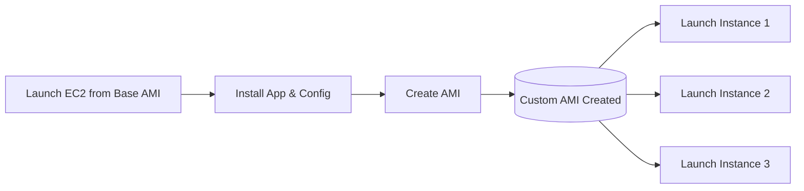

# 3.04 - Amazon Machine Images (AMIs)

## 🎯 Learning Objectives
* Understand what an AMI is and its role in launching EC2 instances.
* Differentiate between AWS-provided, Marketplace, Community, and Custom AMIs.
* Learn the lifecycle of an AMI.

---

## 📚 Detailed Topic Coverage

### What is an AMI?
An **Amazon Machine Image (AMI)** is a master template for the root volume of an EC2 instance. It contains the Operating System (Linux, Windows) and pre-installed software needed to boot up your server.

You **cannot** launch an EC2 instance without selecting an AMI first.

### What does an AMI contain?
1. **Root Volume Template:** A snapshot of the OS, application server, and applications.
2. **Launch Permissions:** Rules that control which AWS accounts can use the AMI.
3. **Block Device Mapping:** Specifies the volumes to attach to the instance when it's launched.

### Types of AMIs

| Type | Description | Example |
| :--- | :--- | :--- |
| **AWS Quick Start AMIs** | Maintained and provided directly by AWS. Highly secure and reliable. | Amazon Linux 2023, Ubuntu 22.04, Windows Server 2022. |
| **AWS Marketplace AMIs** | Sold by third-party vendors. Often includes paid software licenses built-in. | Cisco Firewalls, SAP, pre-configured WordPress. |
| **Community AMIs** | Created and shared by other AWS users for free. Use at your own risk! | A custom Linux build shared by an open-source group. |
| **Custom AMIs (Private)** | Created by YOU from your own instances. | A Golden Image containing your company's code and security agents. |

### The "Golden Image" Concept
In enterprise environments, companies don't install software manually every time. They launch a base OS, install their monitoring tools, security agents, and runtime environments (like Java/Python), and then create a **Custom AMI**. This Custom AMI is called the "Golden Image", and all new servers are launched from it, ensuring consistency and faster boot times.

---

## 🏗️ Architecture: AMI Lifecycle

---

## 💡 Real-World Analogy
Think of an AMI like a **cookie cutter** or a **blueprint** for a house.
The blueprint (AMI) defines where the walls are and what color the paint is. You can use that single blueprint to build 100 identical houses (EC2 instances) very quickly. 

---

## ❓ Doubts Discussed

> **Student:** Are AMIs global? Can I create one in Mumbai and use it in Virginia?
> **Instructor:** **AMIs are Region-Specific.** An AMI created in `ap-south-1` gets a specific AMI ID (e.g., `ami-12345`). To use it in `us-east-1`, you must physically copy the AMI to that region, where it will receive a *new* AMI ID.

> **Student:** Do I pay for Custom AMIs?
> **Instructor:** You don't pay for the AMI entity itself, but you DO pay for the underlying EBS Snapshot (storage space) that holds the AMI data in Amazon S3.

---

## ⚠️ Common Mistakes
* ❌ Hardcoding an AMI ID in an automation script without realizing the script needs to run in multiple regions (the ID will be different!).
* ❌ Leaving secrets/passwords inside a Custom AMI and then making it public.
* ❌ Forgetting to update AMIs (Golden Images) with the latest OS security patches periodically.

---

## 📝 Key Takeaways
📌 AMI = OS + Software Template.
📌 Instances launched from the same AMI are identical clones.
📌 AMIs are scoped to a single AWS Region.
📌 Custom AMIs drastically reduce boot and configuration time.

---

## 🎤 Interview Questions

<b>Basic: What is an AMI and why is it required?</b>

An Amazon Machine Image is a template that contains a software configuration (OS, application server, applications). It is required because it provides the information needed to launch the virtual server (EC2 instance).

<b>Intermediate: Your company has an EC2 instance perfectly configured. You need to launch 50 more identical instances. How do you do this efficiently?</b>

Create a Custom AMI from the perfectly configured instance. Then, use that Custom AMI to launch the 50 new instances. They will boot up as exact clones.

<b>Scenario-Based: You created a custom AMI in `us-east-1` with ID `ami-abc123`. Your colleague in `eu-west-1` tries to launch an instance using `ami-abc123` but gets an error. Why?</b>

AMIs are bound to the region they are created in. The AMI ID `ami-abc123` does not exist in `eu-west-1`. To fix this, you must copy the AMI from `us-east-1` to `eu-west-1`, which will generate a new valid AMI ID for that specific region.

