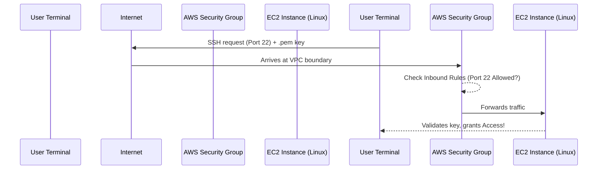

# 3.05 - Launching an EC2 Instance

## 🎯 Learning Objectives
* Launch your first Amazon EC2 instance using the AWS Management Console.
* Understand the core configuration steps (AMI, Type, Network, Storage).
* Connect to your EC2 instance via SSH.

---

## 🛠️ Practical / Hands-On (Step-by-Step)

Let's launch a Linux server in the cloud!

### Step 1: Navigate to EC2 Dashboard
1. Log in to your AWS Management Console.
2. In the top right corner, ensure your Region is set (e.g., `us-east-1` N. Virginia).
3. Search for **EC2** in the top search bar and click it.
4. Click the orange **Launch instance** button.

### Step 2: Name and AMI
1. **Name and tags:** Enter `my-first-ec2`.
2. **Application and OS Images (Amazon Machine Image):** 
   * Select **Amazon Linux**.
   * Under the dropdown, ensure **Amazon Linux 2023 AMI** (Free tier eligible) is selected.

### Step 3: Instance Type
1. **Instance type:** Select `t2.micro` (Free tier eligible). 
   * *Note: In some newer regions, `t3.micro` is the free tier option.*

### Step 4: Key Pair (Crucial for Login)
1. **Key pair (login):** Click **Create new key pair**.
2. **Key pair name:** `my-aws-key`
3. **Key pair type:** RSA
4. **Private key file format:** `.pem` (for Mac/Linux/Windows 10+) or `.ppk` (if you are using old PuTTY on Windows).
5. Click **Create key pair**. 
   * ⚠️ **IMPORTANT:** The `.pem` file will download to your computer. Save it safely! You cannot download it again.

### Step 5: Network Settings
1. Leave the VPC and Subnet as default.
2. **Auto-assign public IP:** Ensure this is **Enable**.
3. **Firewall (security groups):** 
   * Select **Create security group**.
   * Check **Allow SSH traffic from** and set it to **Anywhere (0.0.0.0/0)** for this lab. *(In production, lock this to your specific IP).*

### Step 6: Storage
1. **Configure storage:** Leave as default (8 GiB, `gp3` root volume).

### Step 7: Launch!
1. Review the summary on the right side.
2. Click **Launch instance**.
3. Click on the Instance ID (`i-0abcd...`) to view it in the dashboard. Wait until the Instance State changes to **Running**.

---

## 🔌 Connecting to your Instance

Once running, select your instance in the console and note its **Public IPv4 address** (e.g., `3.85.x.x`).

### Mac / Linux / Windows 10+ (Using Terminal/PowerShell)
1. Open your terminal.
2. Navigate to where your `.pem` file is downloaded:
   ```bash
   cd ~/Downloads
   ```
3. Change the permissions of the key file (Mac/Linux only, skips if Windows):
   ```bash
   chmod 400 my-aws-key.pem
   ```
4. SSH into the instance using the default user `ec2-user`:
   ```bash
   ssh -i my-aws-key.pem ec2-user@<YOUR_PUBLIC_IP>
   ```
5. Type `yes` when prompted about the fingerprint. 
6. 🎉 You are now connected to your AWS cloud server!

---

## 🏗️ Architecture: Connection Flow



---

## ❓ Doubts Discussed

> **Student:** Why do I have to use `chmod 400` on Mac/Linux?
> **Instructor:** SSH is very strict about security. If your private key (`.pem`) has loose permissions (e.g., anyone on your computer can read it), SSH will reject it with a "bad permissions" error. `400` means only YOU can read it.

> **Student:** I got a "Connection Timeout" error. What happened?
> **Instructor:** 99% of the time, this means your Security Group does not have Port 22 open, or you are on a corporate/college Wi-Fi network that blocks Port 22 outbound.

---

## ⚠️ Common Mistakes
* ❌ Losing the `.pem` file. If you lose it, you cannot recover it. You will have to use advanced techniques (like Systems Manager or recreating the instance) to regain access.
* ❌ Trying to log in with `root@ip`. Amazon Linux uses `ec2-user`, Ubuntu uses `ubuntu`, CentOS uses `centos`.
* ❌ Sharing the `.pem` file publicly on GitHub.

---

## 📝 Key Takeaways
📌 You need an AMI, Instance Type, Key Pair, and Security Group to launch an instance.
📌 The Key Pair is your master password; keep it safe.
📌 The default user for Amazon Linux is `ec2-user`.

---

## 🎤 Interview Questions

<details>
<summary><b>Basic: What is the default username to SSH into an Amazon Linux instance?</b></summary>
The default username is `ec2-user`.
</details>

<details>
<summary><b>Intermediate: You have successfully launched an EC2 instance, but you receive a "Connection Timeout" when trying to SSH into it. What is the most likely cause?</b></summary>
The Security Group attached to the EC2 instance does not have an inbound rule allowing SSH (Port 22) traffic from your IP address, or the instance was launched in a private subnet without a public IP.
</details>

<details>
<summary><b>Scenario-Based: An employee left the company and took the `.pem` file for a critical web server. Can you download the `.pem` file again from the AWS console?</b></summary>
No, AWS only provides the private key part of the `.pem` file once during creation. It cannot be downloaded again. You would need to use AWS Systems Manager Session Manager to access the instance, or create an AMI of the instance and launch a new one with a new key pair.
</details>
