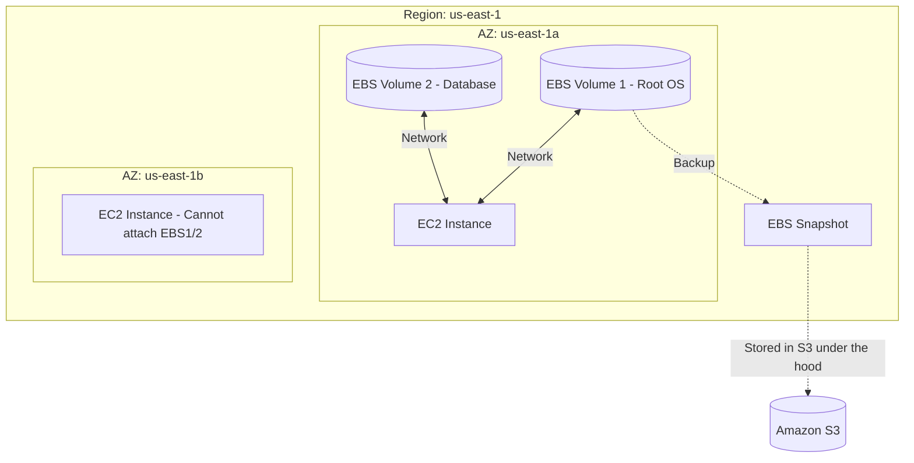

# 3.06 - Amazon EBS (Elastic Block Store)

## 🎯 Learning Objectives
* Understand what EBS is and its role as block storage for EC2.
* Differentiate between EBS Volume Types (gp3, io2, st1, sc1).
* Understand EBS snapshots, encryption, and lifecycle capabilities.

---

## 📚 Detailed Topic Coverage

### What is Amazon EBS?
EBS (Elastic Block Store) is a high-performance, block-level storage service designed for use with EC2 instances. Think of it as a virtual hard drive or USB stick that you plug into your EC2 virtual server.

* **Persistent:** Data remains even if the EC2 instance is stopped or terminated (if configured to do so).
* **Network-Attached:** It is not a physical drive inside the server; it communicates with EC2 over a high-speed network.
* **AZ-Locked:** An EBS volume exists in a specific Availability Zone (e.g., `us-east-1a`). It can ONLY be attached to an EC2 instance in that *same* AZ.

### EBS Volume Types

AWS offers different types of virtual hard drives based on performance (SSD) and cost (HDD).

| Volume Type | Code | Description | Best Use Cases |
| :--- | :--- | :--- | :--- |
| **General Purpose SSD** | `gp3` / `gp2` | Balances price and performance. Default option. | Boot volumes, virtual desktops, low-latency apps. |
| **Provisioned IOPS SSD** | `io2` / `io1` | Highest performance SSD. You specify the exact IOPS you need. | Critical business apps, large relational databases (Oracle, SQL Server). |
| **Throughput Optimized HDD**| `st1` | Low-cost magnetic storage designed for fast, continuous data transfer. | Big Data, Data Warehousing, Log processing. Cannot be a boot volume. |
| **Cold HDD** | `sc1` | Lowest cost magnetic storage for data accessed rarely. | File archives, backups. Cannot be a boot volume. |

### EBS Snapshots
A **Snapshot** is a backup of your EBS volume at a point in time.
* Snapshots are stored in **Amazon S3** (under the hood, managed by AWS).
* They are **Incremental** (only the blocks that have changed since your last snapshot are saved and billed).
* Snapshots can be copied across AWS Regions (this is how you move an EC2/AMI from one region to another!).

### EBS Encryption
You can encrypt an EBS volume using KMS (Key Management Service) AES-256 encryption. Data at rest, data in transit between EC2 and EBS, and all snapshots created from the volume are automatically encrypted.

---

## 🏗️ Architecture: EBS and EC2

---

## 💡 Real-World Analogy
* **EC2:** Your laptop's CPU and RAM.
* **EBS (gp3):** Your laptop's SSD hard drive.
* **EBS Snapshot:** A Time Machine or Windows Backup image of your hard drive, stored safely on an external server.
* **AZ Lock constraint:** Trying to plug a short USB cable into a computer that is in another room. The hard drive (EBS) and the computer (EC2) must be in the same room (AZ).

---

## ❓ Doubts Discussed

> **Student:** Can I attach one EBS volume to multiple EC2 instances at the same time?
> **Instructor:** Standard EBS volumes can only be attached to ONE instance at a time. However, there is a feature called **EBS Multi-Attach** (available only on `io1/io2` volumes) that allows attaching to up to 16 instances in the same AZ. 

> **Student:** If I terminate my EC2 instance, what happens to my EBS volume?
> **Instructor:** By default, the **Root volume** (OS drive) is deleted when the instance is terminated. However, any **additional data volumes** you attached are kept by default. You can change this behavior in the settings (DeleteOnTermination flag).

---

## ⚠️ Common Mistakes
* ❌ Creating an EBS volume in `us-east-1a` and wondering why it doesn't show up in the dropdown when trying to attach it to an EC2 instance in `us-east-1b`.
* ❌ Provisioning high IOPS (`io2`) for a basic web server, resulting in a massive AWS bill.
* ❌ Forgetting to delete unattached EBS volumes (they continue to cost money even when disconnected!).

---

## 📝 Key Takeaways
📌 EBS volumes are network-attached block storage.
📌 They are locked to a single Availability Zone.
📌 `gp3` is the standard for most workloads.
📌 Snapshots are incremental and stored in S3.

---

## 🎤 Interview Questions

<b>Basic: What is an EBS snapshot and where is it stored?</b>

An EBS snapshot is a point-in-time backup of an EBS volume. Snapshots are stored in Amazon S3, though you interact with them via the EC2 console.

<b>Intermediate: How would you move an EBS volume from Availability Zone A to Availability Zone B?</b>

EBS volumes are locked to an AZ. To move it, you must: 1) Take a snapshot of the volume. 2) Create a new volume from that snapshot, specifying the new AZ (Zone B) during creation. 3) Attach the new volume to your instance in Zone B.

<b>Scenario-Based: A client has a legacy Oracle database requiring 60,000 IOPS for consistent performance. Which EBS volume type should they use?</b>

Provisioned IOPS SSD (`io1` or `io2`). General purpose (`gp3`) maxes out at 16,000 IOPS, while `io1/io2` can handle up to 256,000 IOPS and guarantee the exact performance configured.

