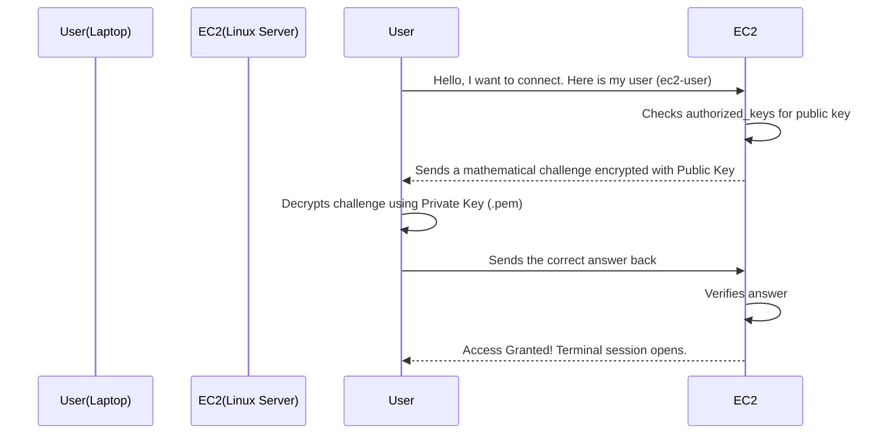

# 3.07 - SSH & Key Pairs

## 🎯 Learning Objectives
* Understand how SSH (Secure Shell) works.
* Learn the mechanics of asymmetric encryption (Public/Private Keys).
* Troubleshoot common connection issues when accessing EC2 instances.

---

## 📚 Detailed Topic Coverage

### What is SSH?
**SSH (Secure Shell)** is a cryptographic network protocol used to securely operate network services over an unsecured network. It is the standard way to connect to Linux servers.
* **Port Number:** SSH always uses **Port 22**.
* **Encryption:** All data sent between your laptop and the EC2 instance is fully encrypted.

### How Key Pairs Work (Asymmetric Encryption)
Passwords can be guessed or brute-forced. AWS uses **Key Pairs** instead.
A Key Pair consists of two mathematically linked files:
1. **Public Key:** AWS stores this inside your EC2 instance (specifically in the `~/.ssh/authorized_keys` file).
2. **Private Key (`.pem`):** You download this to your laptop. It is your master secret.

When you try to log in, the server issues a mathematical challenge that can ONLY be solved if you possess the exact matching Private Key.

### Key Types
* **RSA:** The older, traditional standard. (Usually generates `.pem` or `.ppk` files).
* **ED25519:** A newer, faster, and more secure algorithm. Supported by modern OSs.

### Windows Users and PuTTY
Historically, Windows did not have a built-in SSH client. Users had to download a program called **PuTTY**. PuTTY does not understand `.pem` files, so you had to convert them to `.ppk` (PuTTY Private Key) using PuTTYgen. 
* *Note: Windows 10 and 11 now have OpenSSH built-in, so you can use the standard terminal with `.pem` files just like Mac/Linux!*

---

## 🏗️ Architecture: The SSH Handshake



---

## 🛠️ Practical: Connection Commands

**Standard Connection (Mac/Linux/Win10+):**
```bash
# Step 1: Secure the key (only needed on Mac/Linux)
chmod 400 my-key.pem

# Step 2: Connect
ssh -i my-key.pem ec2-user@<public-ip>
```

**Common Default Usernames:**
* Amazon Linux: `ec2-user`
* Ubuntu: `ubuntu`
* CentOS: `centos`
* Debian: `admin`

---

## ❓ Doubts Discussed (Troubleshooting Guide)

> **Error: "Permission denied (publickey)"**
> **Instructor:** This means the server rejected you. Causes:
> 1. You are using the wrong `.pem` file for this instance.
> 2. You typed the wrong username (e.g., trying to use `root` instead of `ec2-user`).

> **Error: "WARNING: UNPROTECTED PRIVATE KEY FILE!"**
> **Instructor:** Your Mac/Linux machine is complaining that your `.pem` file is too readable. Run `chmod 400 my-key.pem` to fix it.

> **Error: "Connection timed out"**
> **Instructor:** The request never even reached the SSH software on the server.
> 1. Security Group Port 22 is not open to your IP.
> 2. You are using a Private IP instead of a Public IP.
> 3. Your corporate firewall is blocking outbound Port 22.

---

## ⚠️ Common Mistakes
* ❌ Trying to connect to a Windows EC2 instance using SSH (Windows uses RDP - Remote Desktop Protocol on Port 3389).
* ❌ Embedding the `.pem` file inside application code or uploading it to GitHub. (Bots scan GitHub for AWS keys and will hijack your account in seconds).
* ❌ Not modifying the Security Group if your home IP address changes (if you locked Port 22 to your specific IP).

---

## 📝 Key Takeaways
📌 SSH operates on Port 22.
📌 AWS uses Key Pairs (Public/Private) instead of passwords.
📌 `chmod 400` is required for Mac/Linux to secure the file.
📌 Connection Timeout = Security Group issue. Permission Denied = Key/User issue.

---

## 🎤 Interview Questions

<details>
<summary><b>Basic: Which port does SSH use and what is it used for?</b></summary>
SSH uses Port 22. It is used for securely accessing and administering remote Linux servers over the internet via a command-line interface.
</details>

<details>
<summary><b>Intermediate: Explain how public and private keys work together in AWS EC2.</b></summary>
When launching an EC2 instance, AWS places a Public Key inside the instance. You hold the corresponding Private Key on your local machine. When connecting, the server encrypts a challenge using the public key, which can only be decrypted and answered by your private key, proving your identity without ever sending a password over the network.
</details>

<details>
<summary><b>Scenario-Based: A developer complains they get a "Connection Timed Out" error every time they try to SSH into a newly created EC2 instance. What are the two most common things you should check?</b></summary>
1. Check the Security Group attached to the EC2 instance to ensure Inbound Port 22 is open to the developer's IP address.
2. Check if the instance was placed in a Public Subnet and has a Public IP address assigned (you cannot SSH over the internet to a private IP).
</details>
