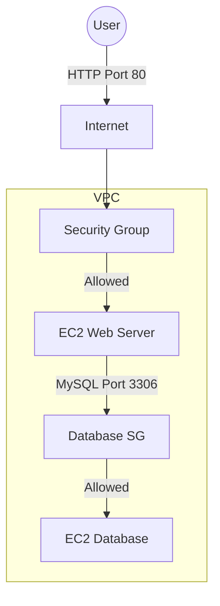

# 3.08 - Security Groups

## 🎯 Learning Objectives
* Understand what a Security Group is and how it protects EC2 instances.
* Learn how to configure Inbound and Outbound rules.
* Grasp the concept of "Stateful" firewall rules.
* Compare Security Groups with Network ACLs (NACLs).

---

## 📚 Detailed Topic Coverage

### What is a Security Group?
A **Security Group (SG)** acts as a virtual firewall for your EC2 instances to control incoming and outgoing traffic.
When you launch an instance, you associate one or more security groups with it. You add rules to each security group that allow traffic to or from its associated instances.

### Key Characteristics
1. **Allow Rules Only:** You cannot create rules that *deny* access (e.g., you cannot say "Block IP 1.2.3.4"). By default, everything is denied. You only punch holes to *allow* what you need.
2. **Stateful:** If you send a request from your instance, the response traffic for that request is allowed to flow in regardless of inbound security group rules. (And vice-versa for inbound traffic).
3. **Instance Level:** They operate at the instance level, not the subnet level. This means each instance in a subnet can have a different firewall configuration.

### Common Rule Configurations

| Protocol | Port | Source/Destination | Use Case |
| :--- | :--- | :--- | :--- |
| **SSH** | 22 | Your IP Address | Securely logging into the Linux terminal. |
| **HTTP** | 80 | `0.0.0.0/0` (Anywhere) | Allowing web traffic to your web server. |
| **HTTPS** | 443 | `0.0.0.0/0` (Anywhere) | Secure web traffic (SSL/TLS). |
| **RDP** | 3389 | Your IP / Corporate IP | Remote Desktop for Windows instances. |
| **Custom TCP** | 8080 | `0.0.0.0/0` or Specific IP | Default port for Tomcat / Jenkins apps. |
| **MySQL/Aurora**| 3306 | Web Server SG | Allowing your web servers to talk to the DB. |

*Note on Sources:* Instead of entering an IP address, you can enter the ID of *another* Security Group! This is highly secure because it allows traffic dynamically even if IPs change.

---

## 🏗️ Architecture: Security Group Flow

---

## 💡 Real-World Analogy
A Security Group is like the **bouncer at an exclusive club**.
* The bouncer only has a VIP list (ALLOW rules). He does not have a list of banned people (No DENY rules). If you aren't on the list, you don't get in.
* **Stateful:** If you are already inside the club and step outside for a phone call, the bouncer remembers your face and lets you back in without checking your ID again.

---

## ❓ Doubts Discussed

> **Student:** What happens if I don't assign a Security Group when creating an EC2?
> **Instructor:** AWS will automatically assign the "Default Security Group" of your VPC. This default group allows all outbound traffic but blocks all external inbound traffic.

> **Student:** Can I change the Security Group after the instance is running?
> **Instructor:** Yes! Unlike the VPC or Subnet (which cannot be changed without re-creating the instance), you can attach/detach Security Groups on the fly with no downtime.

---

## ⚠️ Common Mistakes
* ❌ Opening Port 22 (SSH) to `0.0.0.0/0` (Anywhere). Bots will immediately start brute-forcing your server.
* ❌ Opening Port 3306 (Database) to the internet instead of restricting it to just your Web Server Security Group.
* ❌ Confusing Security Groups (Stateful, Instance level) with NACLs (Stateless, Subnet level).

---

## 📝 Key Takeaways
📌 Security Groups are your first line of defense for EC2.
📌 They are stateful (inbound allowed = outbound response allowed).
📌 They only support ALLOW rules.
📌 Multiple instances can share the same Security Group.

---

## 🎤 Interview Questions

<b>Basic: Can you create a Deny rule in a Security Group?</b>

No, Security Groups only support Allow rules. By default, all inbound traffic is denied until you explicitly add an Allow rule.

<b>Intermediate: Explain what "Stateful" means in the context of a Security Group.</b>

Stateful means the firewall tracks the state of active connections. If an inbound request is permitted by a rule, the return traffic (response) is automatically permitted, regardless of the outbound rules.

<b>Scenario-Based: You want to ensure that only your web servers can access your database instance. Both are EC2 instances. How do you configure the Security Groups?</b>

On the Database instance's Security Group, create an inbound rule for the database port (e.g., 3306). For the Source, instead of using an IP address, reference the Security Group ID attached to your Web Servers. This ensures only instances with that Web SG can connect.

