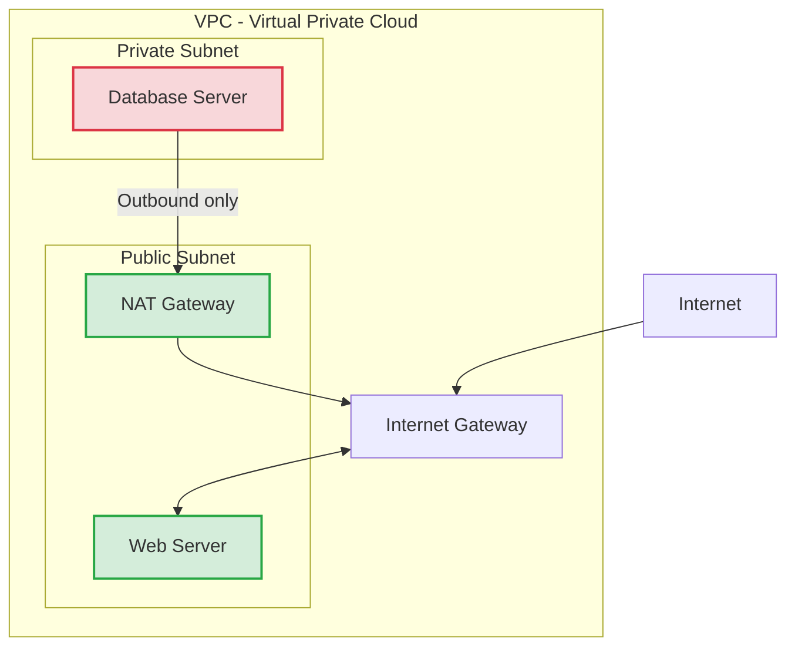

# 3.09 - Public vs Private IP & Elastic IPs

## 🎯 Learning Objectives
* Understand the difference between Public, Private, and Elastic IP addresses.
* Learn when to use which type of IP.
* Grasp the basics of IPv4 vs IPv6 in AWS.

---

## 📚 Detailed Topic Coverage

### Private IPs
A **Private IP** address is an internal IP used for communication *inside* your AWS network (VPC). 
* Every EC2 instance gets a Private IP automatically.
* It is not reachable from the public internet.
* **Persistence:** The private IP stays with the instance for its entire lifetime. Even if you stop and start the instance, the Private IP does *not* change.

### Public IPs
A **Public IP** address allows your EC2 instance to be reachable from the internet.
* **Dynamic:** If you stop (shut down) and start your instance, AWS reclaims the old Public IP and gives you a brand new one.
* Useful for temporary web servers or dev environments where changing IPs isn't an issue.

### Elastic IPs (EIP)
An **Elastic IP** is a static (fixed) IPv4 address designed for dynamic cloud computing.
* It is a public IP that you "buy/reserve" for your account.
* **Persistence:** It never changes, even if you stop/start the instance. 
* You can rapidly remap an Elastic IP to another instance if the current one fails, hiding the failure from your users.

**Pricing Trap:** Elastic IPs are FREE as long as they are attached to a running instance. However, if the instance is stopped, or if the IP is sitting unattached in your account, AWS **charges you by the hour**. (They do this to prevent people from hoarding IPv4 addresses).

---

## 🏗️ Architecture: Public vs Private Subnets

---

## 💡 Real-World Analogy
* **Private IP:** Your office extension number (e.g., Extension 504). People outside the building cannot call this directly.
* **Public IP:** A temporary mobile phone number given to a contractor. When they leave for the day (instance stops), they hand it back. The next day, they might get a different number.
* **Elastic IP:** A toll-free 1-800 number. It never changes, no matter which employee is sitting at the desk answering it.

---

## ❓ Doubts Discussed

> **Student:** Why does my website go down when I restart my EC2 instance?
> **Instructor:** Because you are using a standard Public IP. When you restarted, the IP changed, but your DNS (e.g., Route53 / GoDaddy) is still pointing to the old IP. You need an Elastic IP to prevent this.

> **Student:** Can a private instance talk to the internet to download updates?
> **Instructor:** A purely private instance cannot. It needs a **NAT Gateway** (Network Address Translation) placed in a public subnet to act as a middleman for outbound traffic.

---

## ⚠️ Common Mistakes
* ❌ Allocating an Elastic IP, terminating the instance, and forgetting to "Release" the Elastic IP back to AWS. You will be billed for it!
* ❌ Hardcoding standard Public IPs inside application configuration files.
* ❌ Assigning Public IPs to backend databases. (Databases should only have Private IPs for security).

---

## 📝 Key Takeaways
📌 Private IP = Internal, never changes.
📌 Public IP = External, changes on stop/start.
📌 Elastic IP = External, static, charged if unattached.

---

## 🎤 Interview Questions

<b>Basic: What happens to the Public IP address of an EC2 instance if you stop and restart it?</b>

The public IP address changes. It is released back to the AWS pool when stopped, and a new one is assigned when started.

<b>Intermediate: How does AWS charge for Elastic IPs?</b>

AWS does not charge for an Elastic IP as long as it is associated with a running EC2 instance. However, you are charged an hourly rate if the EIP is unattached or if the associated instance is stopped.

<b>Scenario-Based: Your primary web server (Instance A) crashes. You launch a backup server (Instance B). How can you redirect user traffic to Instance B immediately without waiting for DNS propagation?</b>

Use an Elastic IP. By remapping the Elastic IP from Instance A to Instance B, traffic is instantly redirected because the public-facing IP address remains exactly the same.

