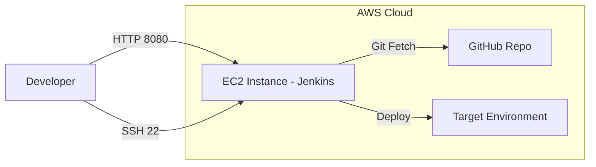

# 3.10 - Practical: Jenkins Deployment (⭐)

## 🎯 Learning Objectives
* Deploy a real-world CI/CD tool (Jenkins) on an EC2 instance.
* Apply concepts of Security Groups, SSH, and Package Management.
* Understand the end-to-end setup of a web service on Linux.

---

## 🛠️ Step-by-Step Lab Exercise

**Objective:** Install and configure Jenkins CI/CD on Amazon Linux 2023.

### Step 1: Launch the EC2 Instance
1. **AMI:** Amazon Linux 2023
2. **Instance Type:** `t2.medium` *(Note: Jenkins requires good RAM. `t2.micro` might freeze, but is okay for light learning).*
3. **Key Pair:** Select your `.pem` key.
4. **Security Group Configuration:**
   * Rule 1: SSH (Port 22) -> Anywhere (or your IP)
   * Rule 2: Custom TCP (Port 8080) -> Anywhere `0.0.0.0/0` (Jenkins runs on 8080).

### Step 2: SSH into the Instance
Open your terminal and connect:
```bash
ssh -i my-aws-key.pem ec2-user@<YOUR_PUBLIC_IP>
```

### Step 3: Install Java (Pre-requisite for Jenkins)
Jenkins is a Java application. Let's install Amazon Corretto 17.
```bash
# Update packages
sudo yum update -y

# Install Java 17
sudo yum install java-17-amazon-corretto -y

# Verify installation
java -version
```

### Step 4: Install Jenkins
Add the Jenkins repository to your package manager and install it.
```bash
# Add repo
sudo wget -O /etc/yum.repos.d/jenkins.repo https://pkg.jenkins.io/redhat-stable/jenkins.repo

# Import key
sudo rpm --import https://pkg.jenkins.io/redhat-stable/jenkins.io-2023.key

# Install Jenkins
sudo yum install jenkins -y
```

### Step 5: Start the Jenkins Service
```bash
# Start the service
sudo systemctl start jenkins

# Enable it to start automatically on system boot
sudo systemctl enable jenkins

# Check if it's running smoothly
sudo systemctl status jenkins
```
*(Press `q` to exit the status view).*

### Step 6: Unlock Jenkins
Jenkins generates a secure one-time password on first boot. Let's fetch it:
```bash
sudo cat /var/lib/jenkins/secrets/initialAdminPassword
```
*Copy this long string of letters and numbers.*

### Step 7: Web Access
1. Open your browser.
2. Go to: `http://<YOUR_PUBLIC_IP>:8080`
3. Paste the password you copied in Step 6.
4. Click **Install suggested plugins**.
5. Create your First Admin User.
6. 🎉 Jenkins is ready!

---

## 🏗️ Architecture Diagram



---

## ❓ Troubleshooting

> **Issue:** I go to `http://ip:8080` and the site can't be reached.
> **Fix:** 
> 1. Did you use `http://` and not `https://`? Jenkins defaults to HTTP.
> 2. Did you open Port 8080 in your Security Group? Check the AWS Console.
> 3. Did the Jenkins service start successfully? Check `sudo systemctl status jenkins`.

---

## ⚠️ Common Mistakes
* ❌ Using `t2.micro` and wondering why the SSH terminal freezes during plugin installation. (OOM - Out of Memory kill).
* ❌ Forgetting to use `sudo` before commands, resulting in "Permission Denied".

---

## 🎤 Interview Questions

<details>
<summary><b>Basic: Which port does Jenkins run on by default?</b></summary>
Port 8080.
</details>

<details>
<summary><b>Intermediate: You want a script to run automatically when the EC2 instance boots up to install Jenkins. How do you do this?</b></summary>
You would place the installation bash script in the "User Data" section under "Advanced Details" during the EC2 launch process. This script runs as root upon the first boot.
</details>

<details>
<summary><b>Scenario-Based: You installed Jenkins, verified `systemctl status jenkins` is active, but your browser times out connecting to port 8080. What is the architecture issue?</b></summary>
The AWS Security Group attached to the instance is blocking inbound traffic on port 8080. You need to add an inbound rule allowing TCP on port 8080 from `0.0.0.0/0`.
</details>
