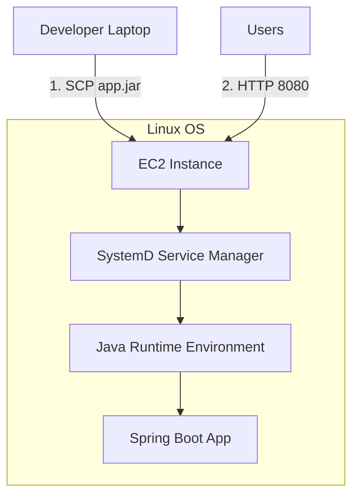

# 3.11 - Practical: Spring Boot Deployment (⭐)

## 🎯 Learning Objectives
* Deploy a compiled Java application (`.jar`) to an EC2 instance.
* Learn how to transfer files securely using SCP (Secure Copy Protocol).
* Run applications in the background so they survive SSH disconnection.

---

## 🛠️ Step-by-Step Lab Exercise

**Objective:** Deploy a sample Spring Boot application on an EC2 instance.

### Prerequisite: Prepare your Application
Assume you have a compiled Spring Boot app named `app.jar` on your local laptop. (If not, you can download a sample one from Spring Initializr and build it).

### Step 1: Launch the EC2 Instance
1. **AMI:** Amazon Linux 2023
2. **Instance Type:** `t2.micro`
3. **Key Pair:** Select your `.pem` key.
4. **Security Group:**
   * SSH (Port 22) -> Your IP
   * Custom TCP (Port 8080) -> `0.0.0.0/0` (Assuming Spring Boot runs on 8080).

### Step 2: SSH and Install Java
Connect to your instance:
```bash
ssh -i my-aws-key.pem ec2-user@<YOUR_PUBLIC_IP>
```
Install Java:
```bash
sudo yum update -y
sudo yum install java-17-amazon-corretto -y
```

### Step 3: Transfer the JAR file (Using SCP)
Open a **new terminal tab** on your *local laptop* (do not run this inside the EC2 instance). We will push the file to the cloud.

```bash
# Syntax: scp -i <key> <source_file> <target_user>@<target_ip>:<target_directory>

scp -i my-aws-key.pem app.jar ec2-user@<YOUR_PUBLIC_IP>:/home/ec2-user/
```
*Wait for the upload to complete.*

### Step 4: Run the Application
Go back to your EC2 SSH terminal. Verify the file is there:
```bash
ls -l
```
Run the application:
```bash
java -jar app.jar
```
*The Spring console logs will appear.*

### Step 5: Test the Application
Open your browser and navigate to: `http://<YOUR_PUBLIC_IP>:8080`
You should see your Spring Boot application!

---

## 🔧 Production Consideration: Background Execution

If you close your SSH terminal right now, the `java -jar` process will be killed, and your website will go down!

**Quick fix (nohup):**
Press `Ctrl+C` to stop it, then run:
```bash
nohup java -jar app.jar > app.log 2>&1 &
```
*(This runs it in the background and saves logs to `app.log`)*

**Production Fix (Systemd):**
For enterprise apps, you create a service file:
```bash
sudo nano /etc/systemd/system/myapp.service
```
Add:
```ini
[Unit]
Description=My Spring Boot App

[Service]
User=ec2-user
ExecStart=/usr/bin/java -jar /home/ec2-user/app.jar
SuccessExitStatus=143

[Install]
WantedBy=multi-user.target
```
Then start it like a pro:
```bash
sudo systemctl enable myapp
sudo systemctl start myapp
```

---

## 🏗️ Architecture Diagram



---

## ❓ Doubts Discussed

> **Student:** Can I run it on Port 80 instead of 8080 so users don't have to type the port?
> **Instructor:** Yes, but Linux restricts ports below 1024 to the `root` user for security. Instead of running Java as root (bad practice), we use a Reverse Proxy like **Nginx** running on Port 80, which silently forwards traffic to Java on 8080.

---

## ⚠️ Common Mistakes
* ❌ Closing the SSH terminal without using `nohup` or `systemd`, causing the site to crash instantly.
* ❌ Using the wrong path in the SCP command.

---

## 🎤 Interview Questions

<details>
<summary><b>Basic: How do you securely transfer a file from your local machine to an EC2 Linux instance?</b></summary>
Using SCP (Secure Copy Protocol) or SFTP with the same private key (`.pem`) used for SSH access.
</details>

<details>
<summary><b>Intermediate: If you run an application using `./app.sh` in SSH, it stops when you close the terminal. How do you prevent this?</b></summary>
You can run it in the background using `nohup ./app.sh &`, or use a terminal multiplexer like `tmux`/`screen`, or ideally create a `systemd` service for it.
</details>
