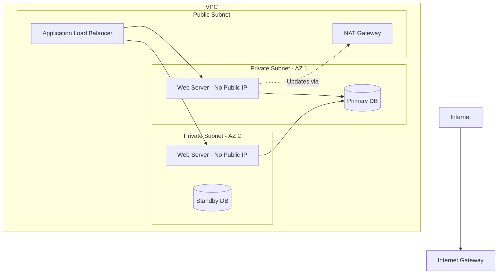

# 3.12 - EC2 Best Practices & Common Mistakes

## 🎯 Learning Objectives
* Learn industry-standard best practices for operating EC2.
* Understand how to optimize costs and security.
* Avoid common pitfalls that lead to data loss or security breaches.

---

## 📚 Best Practices

### 🛡️ Security
1. **Never use IAM Access Keys inside EC2:** Do not hardcode keys or run `aws configure`. Instead, attach an **IAM Role** to the EC2 instance. It automatically provides temporary credentials.
2. **Principle of Least Privilege for Security Groups:** Do not use `0.0.0.0/0` unless it is a public web server (Port 80/443). Restrict SSH (Port 22) to your VPN or office IP.
3. **Use Private Subnets:** Put databases and application backends in Private Subnets so they are impossible to reach directly from the internet.
4. **Regular Patching:** Periodically update your AMIs with the latest OS security patches. AWS Systems Manager can automate this.

### 💰 Cost Optimization
1. **Right-Sizing:** Monitor CloudWatch metrics. If an `m5.xlarge` is constantly running at 5% CPU, downsize it to an `m5.large` to save 50% immediately.
2. **Stop Unused Instances:** Dev/Test environments should be turned off at night and on weekends. (Use AWS Instance Scheduler).
3. **Use the right Pricing Model:**
   * Prod DBs -> Reserved Instances.
   * Batch Jobs/Workers -> Spot Instances.
   * Standard Apps -> Savings Plans.
4. **Release Elastic IPs:** EIPs cost money when not attached to a running instance.

### 🚀 Reliability & Performance
1. **Multi-AZ Architecture:** Never rely on a single EC2 instance. Put instances behind a Load Balancer across at least two Availability Zones.
2. **Termination Protection:** Enable this setting on critical instances to prevent accidental deletion by junior admins.
3. **Automate Backups:** Use Amazon Data Lifecycle Manager (DLM) to automatically take daily EBS snapshots of your drives.

---

## ⚠️ Common Mistakes (The "Do Not Do" List)

| Mistake | Consequence | How to Fix |
| :--- | :--- | :--- |
| **Leaving Default SG wide open** | Hackers brute-force your SSH or RDP. | Remove `0.0.0.0/0` from Port 22/3389. |
| **Storing data on Ephemeral Storage** | Instance Stop/Start deletes the data. | Always use EBS (Elastic Block Store) for persistent data. |
| **Not tagging resources** | Your AWS bill becomes unreadable (you don't know who launched what). | Enforce tagging policies (e.g., `Env: Prod`, `Project: Alpha`). |
| **Uploading `.pem` keys to GitHub** | Bots steal the key and launch crypto-miners on your account. | Add `.pem` to `.gitignore`. Rotate compromised keys instantly. |

---

## 🏗️ Architecture: The "Perfect" Secure Setup

---

## 🎤 Interview Questions

<b>Scenario-Based: An application running on EC2 needs to download objects from an S3 bucket. How should you securely provide access to the EC2 instance?</b>

Create an IAM Role with a policy granting read access to the specific S3 bucket. Attach this IAM Role to the EC2 instance (Instance Profile). Never put hardcoded IAM Access Keys on the instance.

<b>Scenario-Based: A junior developer accidentally deleted a production EC2 instance via the console. How could this have been prevented?</b>

By enabling "Termination Protection" on the EC2 instance. When enabled, a user must explicitly disable the protection flag before the console or API will allow the termination command to execute.

