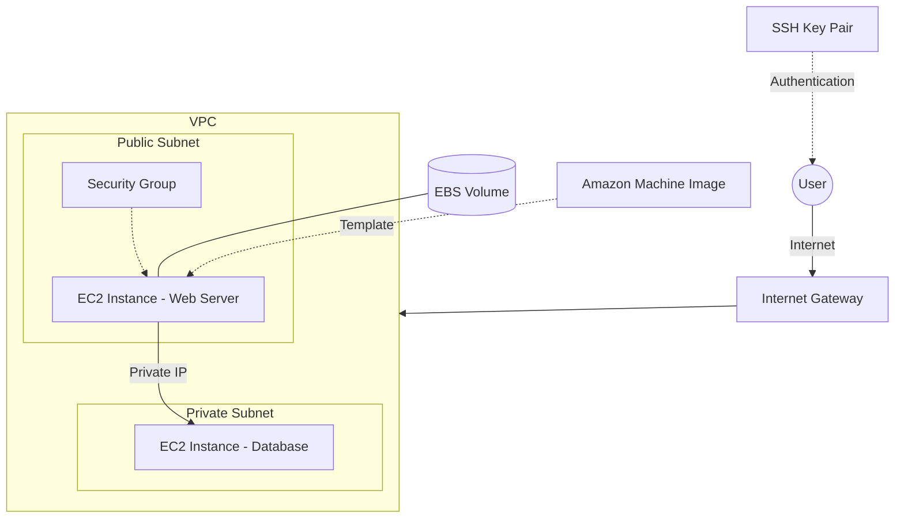

# 🚀 Chapter 3: Amazon EC2 (Elastic Compute Cloud)

Welcome to **Chapter 3** of the AWS Zero to Hero handbook! In this chapter, we dive deep into one of the oldest, most foundational, and most popular services in AWS: **Amazon EC2**.

## 🎯 Learning Path

This chapter is designed to take you from absolute basics to deploying real-world applications on EC2 instances. 

Here is your learning journey:

| Section | Topic | Description |
| :--- | :--- | :--- |
| **3.01** | [Introduction to EC2](./3.01-Introduction-to-EC2/README.md) | What is EC2, Use Cases, Pricing Models |
| **3.02** | [Regions & AZs](./3.02-Regions-and-AZs/README.md) | Global Infrastructure, Fault Tolerance |
| **3.03** | [Instance Types](./3.03-Instance-Types/README.md) | Families, Sizes, Naming Conventions |
| **3.04** | [AMIs](./3.04-AMIs/README.md) | Amazon Machine Images, Custom Images |
| **3.05** | [Launching an EC2](./3.05-Launching-EC2/README.md) | Step-by-Step Practical Lab |
| **3.06** | [EBS Volumes](./3.06-EBS-Volumes/README.md) | Elastic Block Store, Storage Types |
| **3.07** | [SSH & Key Pairs](./3.07-SSH-and-Key-Pairs/README.md) | Secure Access, Troubleshooting |
| **3.08** | [Security Groups](./3.08-Security-Groups/README.md) | Virtual Firewalls, Stateful Rules |
| **3.09** | [Public vs Private IP](./3.09-Public-vs-Private-IP/README.md) | Network Addressing, Elastic IPs |
| **3.10** | [Practical - Jenkins](./3.10-Practical-Jenkins-Deployment/README.md) | CI/CD Deployment Lab (⭐) |
| **3.11** | [Practical - Spring Boot](./3.11-Practical-Spring-Boot-Deployment/README.md) | Java App Deployment Lab (⭐) |
| **3.12** | [Best Practices](./3.12-Best-Practices/README.md) | Do's, Don'ts, and Cost Savings |
| **3.13** | [Interview Questions](./3.13-Interview-Questions/README.md) | Basic to Scenario-based Q&A |

---

## 🏗️ EC2 Ecosystem Architecture

## 📝 Prerequisites

Before starting this chapter, ensure you have:
1. Created an AWS Free Tier account.
2. Completed Chapter 2 (IAM) - understanding Users, Groups, and Roles is crucial.
3. Configured billing alerts to avoid unexpected charges.

Let's get started with [3.01 - Introduction to EC2](./3.01-Introduction-to-EC2/README.md)!
