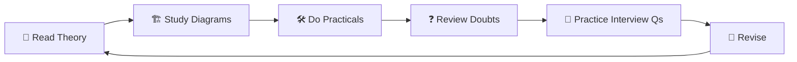

# 📘 AWS Zero to Hero — Complete Handbook

### By **Rajesh Bandi** & **ChatGPT**

---

> *A comprehensive, hands-on guide to mastering AWS — from cloud fundamentals to production-ready deployments.*

---

## 🗺️ Handbook Overview

This handbook captures our **complete learning journey** — every concept explained, every practical performed, every doubt resolved, and every interview question discussed. It's designed to be your **single source of truth** for AWS preparation.

---

## 📖 Table of Contents

### [Chapter 1 — Cloud Computing](./Chapter-01-Cloud-Computing/README.md)

| # | Section | Topics |
|---|---------|--------|
| 1.1 | [Introduction to Cloud Computing](./Chapter-01-Cloud-Computing/1.01-Introduction-to-Cloud-Computing/README.md) | What, Why, Evolution, Characteristics |
| 1.2 | [Data Center](./Chapter-01-Cloud-Computing/1.02-Data-Center/README.md) | Components, Physical Security, Cooling |
| 1.3 | [Physical Servers](./Chapter-01-Cloud-Computing/1.03-Physical-Servers/README.md) | CPU, RAM, Storage, Networking |
| 1.4 | [Hypervisor](./Chapter-01-Cloud-Computing/1.04-Hypervisor/README.md) | Type 1, Type 2, Virtualization |
| 1.5 | [Virtual Machine](./Chapter-01-Cloud-Computing/1.05-Virtual-Machine/README.md) | Guest OS, Host OS, Isolation |
| 1.6 | [Virtualization](./Chapter-01-Cloud-Computing/1.06-Virtualization/README.md) | Resource Utilization, Multi-tenancy |
| 1.7 | [Public Cloud](./Chapter-01-Cloud-Computing/1.07-Public-Cloud/README.md) | AWS, Azure, GCP |
| 1.8 | [Private Cloud](./Chapter-01-Cloud-Computing/1.08-Private-Cloud/README.md) | VMware, OpenStack |
| 1.9 | [Hybrid Cloud](./Chapter-01-Cloud-Computing/1.09-Hybrid-Cloud/README.md) | Architecture, Use Cases |
| 1.10 | [Pay-As-You-Go](./Chapter-01-Cloud-Computing/1.10-Pay-As-You-Go/README.md) | Billing, Elasticity, Cost |
| 1.11 | [Cloud Repatriation](./Chapter-01-Cloud-Computing/1.11-Cloud-Repatriation/README.md) | Why Companies Move Back |
| 1.12 | [Practical Examples](./Chapter-01-Cloud-Computing/1.12-Practical-Examples/README.md) | Spring Boot, TunnelFlow |
| 1.13 | [Real-world Analogies](./Chapter-01-Cloud-Computing/1.13-Real-World-Analogies/README.md) | Apartment, Hotel, Taxi |
| 1.14 | [Interview Questions](./Chapter-01-Cloud-Computing/1.14-Interview-Questions/README.md) | Basic, Intermediate, Scenario |

---

### [Chapter 2 — AWS IAM](./Chapter-02-AWS-IAM/README.md)

| # | Section | Topics |
|---|---------|--------|
| 2.1 | [Introduction to IAM](./Chapter-02-AWS-IAM/2.01-Introduction-to-IAM/README.md) | Identity, Access Management, Least Privilege |
| 2.2 | [Authentication](./Chapter-02-AWS-IAM/2.02-Authentication/README.md) | Username, Password, MFA, Access Keys |
| 2.3 | [Authorization](./Chapter-02-AWS-IAM/2.03-Authorization/README.md) | Policy Evaluation, Allow, Deny |
| 2.4 | [Root User](./Chapter-02-AWS-IAM/2.04-Root-User/README.md) | Risks, Best Practices, MFA |
| 2.5 | [IAM Users](./Chapter-02-AWS-IAM/2.05-IAM-Users/README.md) | Console Access, Programmatic Access |
| 2.6 | [IAM Groups](./Chapter-02-AWS-IAM/2.06-IAM-Groups/README.md) | Group Inheritance, Managing Permissions |
| 2.7 | [IAM Policies](./Chapter-02-AWS-IAM/2.07-IAM-Policies/README.md) | Managed, Inline, Customer Managed |
| 2.8 | [Version Field](./Chapter-02-AWS-IAM/2.08-Version-Field/README.md) | Policy Language Version |
| 2.9 | [ARN](./Chapter-02-AWS-IAM/2.09-ARN/README.md) | Structure, Components |
| 2.10 | [Actions](./Chapter-02-AWS-IAM/2.10-Actions/README.md) | Service Actions, Wildcards |
| 2.11 | [Resources](./Chapter-02-AWS-IAM/2.11-Resources/README.md) | Bucket ARN, Object ARN, EC2 ARN |
| 2.12 | [Conditions](./Chapter-02-AWS-IAM/2.12-Conditions/README.md) | Time, IP, MFA Based |
| 2.13 | [Explicit Deny](./Chapter-02-AWS-IAM/2.13-Explicit-Deny/README.md) | Policy Evaluation Logic |
| 2.14 | [IAM Roles](./Chapter-02-AWS-IAM/2.14-IAM-Roles/README.md) | Service Roles, Cross-Account |
| 2.15 | [Trust Policy](./Chapter-02-AWS-IAM/2.15-Trust-Policy/README.md) | Who Can Assume a Role |
| 2.16 | [Permission Policy](./Chapter-02-AWS-IAM/2.16-Permission-Policy/README.md) | What Actions Are Allowed |
| 2.17 | [STS](./Chapter-02-AWS-IAM/2.17-STS/README.md) | Temporary Credentials, Session Token |
| 2.18 | [⭐ Practical — IAM User with Access Keys](./Chapter-02-AWS-IAM/2.18-Practical-IAM-User-Access-Keys/README.md) | CLI Configuration, Credential Management |
| 2.19 | [⭐ Practical — EC2 Role Instead of Access Keys](./Chapter-02-AWS-IAM/2.19-Practical-EC2-Role/README.md) | IMDS, STS, Best Practices |

---

### [Chapter 3 — Amazon EC2](./Chapter-03-Amazon-EC2/README.md)

| # | Section | Topics |
|---|---------|--------|
| 3.1 | [Introduction to EC2](./Chapter-03-Amazon-EC2/3.01-Introduction-to-EC2/README.md) | Elastic Compute Cloud, Use Cases |
| 3.2 | [Regions & Availability Zones](./Chapter-03-Amazon-EC2/3.02-Regions-and-AZs/README.md) | Global Infrastructure |
| 3.3 | [Instance Types](./Chapter-03-Amazon-EC2/3.03-Instance-Types/README.md) | Families, Naming Convention |
| 3.4 | [AMIs](./Chapter-03-Amazon-EC2/3.04-AMIs/README.md) | Amazon Machine Images |
| 3.5 | [Launching an EC2 Instance](./Chapter-03-Amazon-EC2/3.05-Launching-EC2/README.md) | Step-by-Step Launch |
| 3.6 | [EBS Volumes](./Chapter-03-Amazon-EC2/3.06-EBS-Volumes/README.md) | Storage Types, IOPS |
| 3.7 | [SSH & Key Pairs](./Chapter-03-Amazon-EC2/3.07-SSH-and-Key-Pairs/README.md) | Connecting to Instances |
| 3.8 | [Security Groups](./Chapter-03-Amazon-EC2/3.08-Security-Groups/README.md) | Inbound, Outbound Rules |
| 3.9 | [Public vs Private IP](./Chapter-03-Amazon-EC2/3.09-Public-vs-Private-IP/README.md) | Elastic IP, NAT |
| 3.10 | [⭐ Practical — Jenkins Deployment](./Chapter-03-Amazon-EC2/3.10-Practical-Jenkins-Deployment/README.md) | CI/CD on EC2 |
| 3.11 | [⭐ Practical — Spring Boot Deployment](./Chapter-03-Amazon-EC2/3.11-Practical-Spring-Boot-Deployment/README.md) | Java App on EC2 |
| 3.12 | [Best Practices & Common Mistakes](./Chapter-03-Amazon-EC2/3.12-Best-Practices/README.md) | Security, Cost, Performance |
| 3.13 | [Interview Questions](./Chapter-03-Amazon-EC2/3.13-Interview-Questions/README.md) | Basic, Intermediate, Scenario |

---

## 🎯 How to Use This Handbook

| Icon | Meaning |
|------|---------|
| 📌 | Key Point |
| 💡 | Tip / Insight |
| ⚠️ | Warning / Caution |
| 🎯 | Learning Objective |
| 🔥 | Important Concept |
| ❓ | Doubt / Question Discussed |
| ✅ | Correct Approach |
| ❌ | Incorrect / Anti-pattern |
| 🏗️ | Architecture Diagram |
| 📝 | Note |
| 🎤 | Interview Question |
| 🛠️ | Practical / Hands-On |
| ⭐ | Key Practical Exercise |

---

## 📊 Progress Tracker

| Chapter | Sections | Status |
|---------|----------|--------|
| Ch 1 — Cloud Computing | 14 | ✅ Complete |
| Ch 2 — AWS IAM | 19 | ✅ Complete |
| Ch 3 — Amazon EC2 | 13 | ✅ Complete |

---

## 🧭 Quick Navigation

- **New to Cloud?** → Start with [Chapter 1.1 — Introduction](./Chapter-01-Cloud-Computing/1.01-Introduction-to-Cloud-Computing/README.md)
- **Setting up AWS?** → Jump to [Chapter 2.5 — IAM Users](./Chapter-02-AWS-IAM/2.05-IAM-Users/README.md)
- **Need a Server?** → Go to [Chapter 3.5 — Launching EC2](./Chapter-03-Amazon-EC2/3.05-Launching-EC2/README.md)
- **Interview Prep?** → Check section-level interview questions in every README

---

> 💡 **Tip**: Each section is self-contained. You can read them in order or jump to any topic you need to revise.

---

*Last Updated: July 2026*
